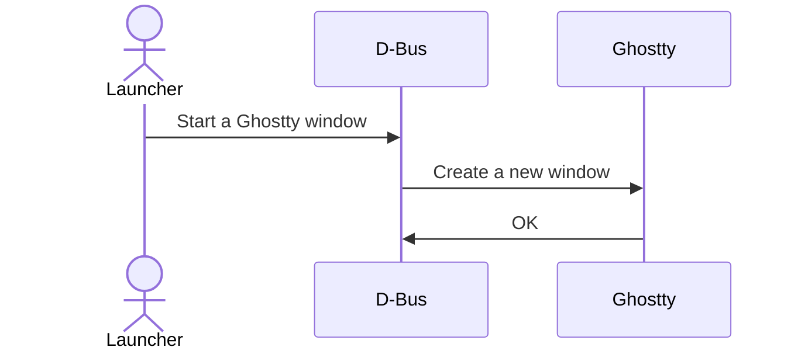
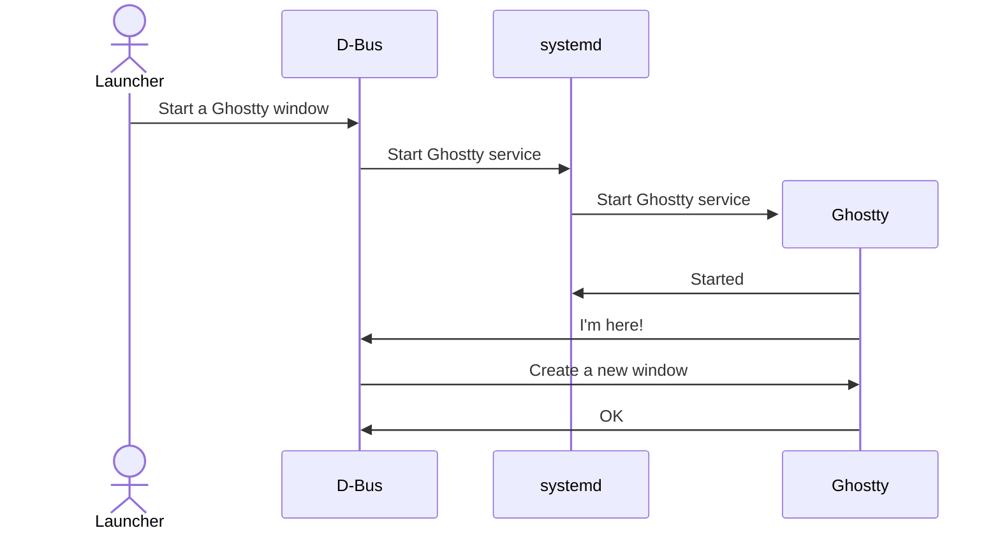

# Notes on Running Ghostty on Linux

## Launching

If installed by a system package or by compiling from source and installing into
`$HOME/.local` (with `zig build -p $HOME/.local -Doptimize=ReleaseFast`) several
configuration files will be installed which allow Ghostty to be launched from
most GUI application launchers (like Gnome Shell or KDE Plasma).

These are the files that control the launching of Ghostty if installed as
a user:

```
$PREFIX/share/applications/com.mitchellh.ghostty.desktop
$PREFIX/share/dbus-1/services/com.mitchellh.ghostty.service
$PREFIX/share/systemd/user/com.mitchellh.ghostty.service
```

If installed as a system package, the files will be found in the following
locations:

```
$PREFIX/share/applications/com.mitchellh.ghostty.desktop
$PREFIX/share/dbus-1/services/com.mitchellh.ghostty.service
$PREFiX/lib/systemd/user/com.mitchellh.ghostty.service
```

Ghostty takes advantage of D-Bus activation and `systemd` user services to provide
the best experience possible.

The application launcher, instead of executing Ghostty directly, will send a
signal to the D-Bus session broker asking it to open a Ghostty window. The
D-Bus session broker will check D-Bus to see if Ghostty is already running. If
Ghostty is already running, the broker will send a D-Bus signal to Ghostty to
create a new window.



If Ghostty is not running, the D-Bus session broker will ask `systemd` to start
Ghostty in a user service, and then will send Ghostty a D-Bus signal to create a
new window.



This ensures that any startup delay caused by GTK (or any other initialization) is
only incurred once per login.

The Ghostty `systemd` user service can be configured to start up as soon as you
log in by running this command:

```sh
systemctl enable --user com.mitchell.ghostty.service
```

By doing so any startup delay will be "hidden" by the time that your system
needs to finish setting up everything after logging in.

## Stopping Ghostty

The Ghostty `systemd` user service can be stopped by running:

```sh
systemctl stop --user com.mitchellh.ghostty.service
```

> [!WARNING]
>
> There is a chance of data loss if the above command is run while there are any
> open Ghostty windows with programs running in them. Any programs running in
> Ghostty windows will be killed without asking for any confirmation.

## Logs

Any logs emitted by the Ghostty `systemd` user service can be seen by running
this command:

```sh
journalctl -a -f --user -u com.mitchellh.ghostty.service
```

## Creating New Windows

With D-Bus activation and `systemd` user services in use, simply launching
`ghostty` from the CLI (or through a global keybind) will not create a new
Ghostty terminal window. The following command can be used to send a D-Bus
signal to Ghostty to create a new window:

```sh
gdbus call --session --dest com.mitchellh.ghostty --object-path /com/mitchellh/ghostty --method org.gtk.Actions.Activate new-window [] []
```

This command will create a new Ghostty window even if Ghostty is not already
running as D-Bus activation will cause Ghostty to be launched.

## Reloading the Config

In addition to other methods, sending the `USR2` signal to the Ghostty process
will trigger a configuration reload.

## Debug Installations

If you have installed a debug version of Ghostty, the above commands and file
paths need to be altered slightly:

```sh
systemctl enable --user com.mitchell.ghostty-debug.service
journalctl -a -f --user -u com.mitchellh.ghostty-debug.service
gdbus call --session --dest com.mitchellh.ghostty-debug --object-path /com/mitchellh/ghostty_debug --method org.gtk.Actions.Activate new-window [] []
```

These are the files that control the launching of Ghostty if installed as
a user:

```
$PREFIX/share/applications/com.mitchellh.ghostty-debug.desktop
$PREFIX/share/dbus-1/services/com.mitchellh.ghostty-debug.service
$PREFIX/share/systemd/user/com.mitchellh.ghostty-debug.service
```

If installed as a system package, the files will be found in the following
locations:

```
$PREFIX/share/applications/com.mitchellh.ghostty-debug.desktop
$PREFIX/share/dbus-1/services/com.mitchellh.ghostty-debug.service
$PREFiX/lib/systemd/user/com.mitchellh.ghostty-debug.service
```
