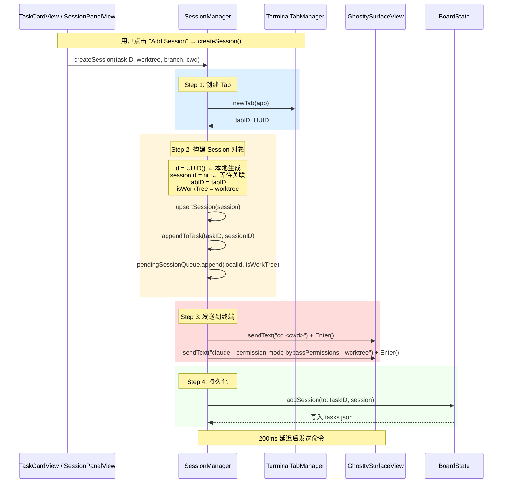
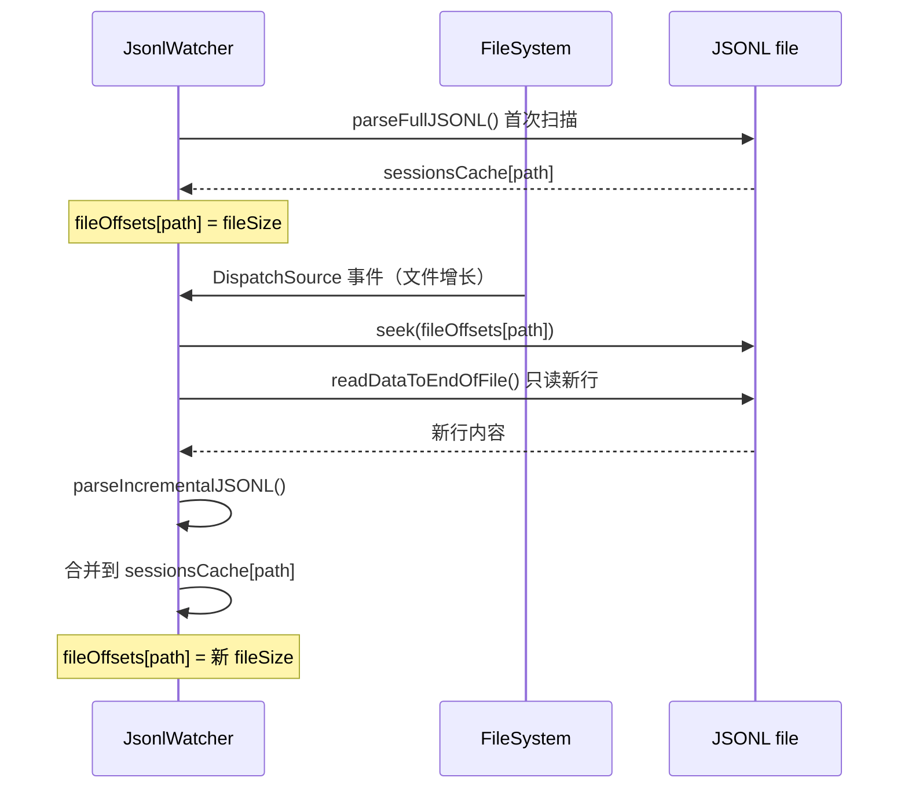
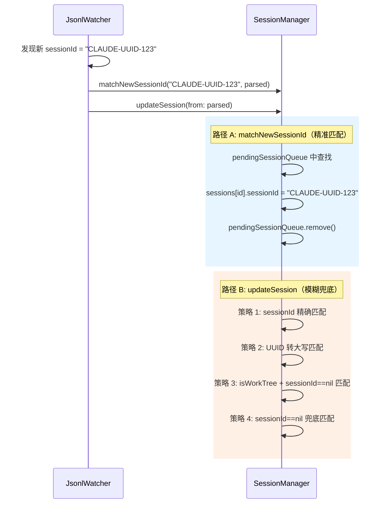
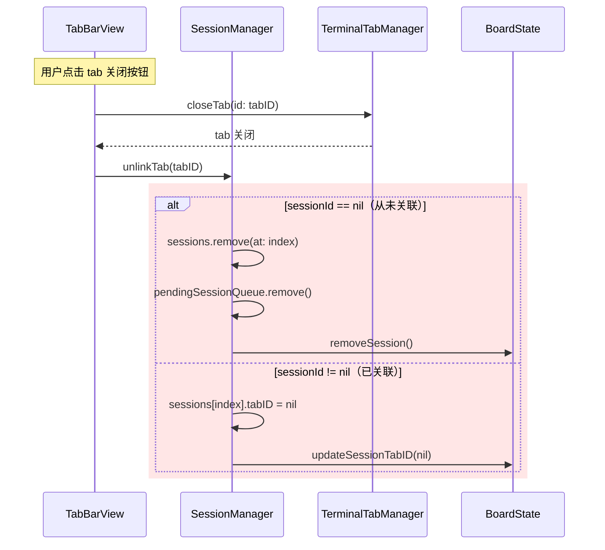

# Session 创建与关联机制分析

## 1. 概述

Session 关联的目标是：**把用户点击"Add Session"创建的本地 `Session` 记录**，与 **Claude Code 运行后在 `~/.claude/projects/` 下生成的 `.jsonl` 文件**绑定起来。

绑定后可以：
- 显示 Claude session 的真实状态（running/idle/needInput）
- 更新 session 标题
- 关联 branch / cwd 等元数据
- 支持 resume（通过 `sessionId` 重连）

---

## 2. 核心数据模型

```swift
// KanbanModels.swift
struct Session: Identifiable, Codable {
    var id: UUID              // 本地 UUID，由应用生成
    var title: String         // 从 JSONL 更新的标题
    var status: SessionStatus // running / idle / needInput
    var timestamp: Date
    var isWorkTree: Bool      // 是否为 worktree session
    var branch: String       // 分支名
    var sessionId: String?   // Claude 生成的 session UUID（关联前为 nil）
    var tabID: UUID?         // 关联的终端 Tab ID
    var cwd: String?
}

// JsonlWatcher.swift
struct ParsedSession {
    let sessionId: String     // JSONL 中的 session UUID（文件名或字段）
    var title: String = "New Session"
    var status: SessionStatus = .idle
    var isWorkTree: Bool = false   // ⚠️ 从 JSONL 解析，依赖 worktree-state 事件
    var branch: String?
    var cwd: String?
    var createdAt: Date?
}
```

**关键字段对比：**

| 字段 | Session（本地的） | ParsedSession（JSONL 的） |
|------|-----------------|--------------------------|
| `id` / `sessionId` | `id: UUID`（本地） | `sessionId: String`（Claude 生成） |
| 唯一性 | 应用内唯一 | Claude 全局唯一 |
| 关联时机 | 创建时确定 | 运行时从 JSONL 提取 |
| 关联标志 | `sessionId` 从 `nil` 变为非 nil | — |

---

## 3. Session 创建流程



### 关键状态（创建后）

```
Session {
    id = A1B2C3...       // 本地 UUID
    sessionId = nil       // ⚠️ 尚未关联，等待 JSONL 匹配
    tabID = tabID
    isWorkTree = true    // 用户指定的
}

pendingSessionQueue = [
    { localId: A1B2C3..., isWorkTree: true, createdAt: ... }
]
```

---

## 4. JSONL 文件监控流程

### 4.1 监控路径

```
ContentView.onAppear → JsonlWatcher(path: watchPath).start()

watchPath 计算逻辑：
├── boardState.workspacePath 有值 → ~/.claude/projects/<encoded-workspace>/
└── boardState.workspacePath 为空 → ~/.claude/projects/
```

### 4.2 文件系统监控

```mermaid
flowchart TD
    subgraph JsonlWatcher
        A[setupDirectoryMonitoring] --> B[open(path, O_EVTONLY)]
        B --> C[DispatchSourceFileSystemObject]
        C --> D["eventMask: .write .rename .delete .extend"]
        D --> E[debounce 200ms]
        E --> F[performScan]
    end

    subgraph performScan
        F --> G[enumerateJsonlFiles]
        G --> H{文件有变化?}
        H -->|No| I[跳过]
        H -->|Yes| J[parseJSONL incremental]
        J --> K["changedSessions: [sessionId: ParsedSession]"]
        K --> L["seenSessionIds: Set<String>"]
        L --> M{新 sessionId?}
        M -->|New| N[onNewSessionId(sessionId, parsed)]
        M -->|Yes| O[onChange(changedSessions)]
    end
```

### 4.3 JSONL 增量解析



---

## 5. Session 关联流程（核心）

关联的本质：**用 `sessionId`（Claude 生成的 UUID）匹配 `Session.id`（本地 UUID）**。

匹配发生在两个 callback：



### 5.1 matchNewSessionId — 精准匹配

```swift
// SessionManager.swift line 364-388
func matchNewSessionId(_ claudeSessionId: String, from parsed: ParsedSession) {
    let isParsedWorktree = parsed.isWorkTree

    // ① 优先找 isWorkTree 类型匹配的 pending session
    let candidates = pendingSessionQueue.filter { $0.isWorkTree == isParsedWorktree }
    // ② 找不到则 fallback 到 FIFO（第一个 pending）
    let entry = candidates.first ?? pendingSessionQueue.first
    guard let entry else { return }

    // 更新 Session.sessionId ← claudeSessionId
    if let index = sessions.firstIndex(where: { $0.id == entry.localId }) {
        sessions[index].sessionId = claudeSessionId
        // 同步到 BoardState 持久化
        if let taskID = sessionTaskMap[entry.localId] {
            BoardState.shared.updateSessionFromParsed(...)
        }
    }

    pendingSessionQueue.removeAll { $0.localId == entry.localId }
}
```

### 5.2 updateSession — 兜底匹配

```swift
// SessionManager.swift line 261-292
func updateSession(from parsed: ParsedSession) {
    // 策略 1: sessionId 精确相等
    if let index = sessions.firstIndex(where: { $0.sessionId == parsed.sessionId }) {
        matchedIndex = index
    }
    // 策略 2: 本地 id 转大写 == claude sessionId
    else if let index = sessions.firstIndex(where: {
        $0.id.uuidString.uppercased() == parsed.sessionId.uppercased()
    }) {
        sessions[index].sessionId = parsed.sessionId
        matchedIndex = index
    }
    // 策略 3: isWorkTree 精确匹配 + sessionId 为 nil
    else if let index = sessions.firstIndex(where: { session in
        guard session.sessionId == nil else { return false }
        guard session.isWorkTree == parsed.isWorkTree else { return false }
        return true
    }) {
        sessions[index].sessionId = parsed.sessionId
        matchedIndex = index
    }
    // 策略 4: 兜底 —— 任意 sessionId 为 nil 的 session
    else if let index = sessions.firstIndex(where: { $0.sessionId == nil }) {
        sessions[index].sessionId = parsed.sessionId
        matchedIndex = index
    }
}
```

---

## 6. 数据存储与同步

### 6.1 三个存储位置

```mermaid
flowchart LR
    subgraph SM["SessionManager (内存)"]
        sessions["[Session] @Published"]
        pendingQ["pendingSessionQueue"]
        taskIDs["taskSessionIDs"]
        sessionMap["sessionTaskMap"]
    end

    subgraph BS["BoardState (内存 + 磁盘)"]
        tasks["tasks: [KanbanTask]"]
        persistence["→ tasks.json"]
    end

    subgraph JSONL["文件系统"]
        jsonl["~/.claude/projects/*/*.jsonl"]
    end

    SM -->|"reconcile(from:)"| BS
    SM -->|"addSession / updateSessionFromParsed"| BS
    JW -->|"onNewSessionId / onChange"| SM
    JSONL -->|"parseJSONL"| JW
```



### 6.2 同步规则

| 操作 | SessionManager | BoardState | 方向 |
|------|---------------|------------|------|
| 创建 session | `upsertSession` + `appendToTask` + `pendingQueue` | `addSession` | SessionManager → BoardState |
| JSONL 匹配成功 | `sessionId` 赋值 | `updateSessionFromParsed` | SessionManager → BoardState |
| Tab 关闭 | `unlinkTab` | `removeSession` 或 `updateSessionTabID(nil)` | TabBarView → SessionManager |
| BoardState 删除 session | `handleBoardStateChange` | — | BoardState → SessionManager |

### 6.3 reconcile 机制

App 启动时：
```
BoardState.load() → tasks.json 加载
SessionManager.reconcile(from: tasks) → 重建所有索引
```
这确保 BoardState 管理的持久化数据与 SessionManager 内存索引一致。

---

## 7. Tab 与 Session 的绑定/解绑

### 7.1 绑定（创建时）

```
createSession()
  → tabManager.newTab() → tabID
  → Session.tabID = tabID
  → boardState.addSession() → 持久化
```

### 7.2 解绑（Tab 关闭时）



**注意**：`unlinkTab` 只修改 Tab 视角的绑定，不影响 `Session.id` / `sessionId` 的关联关系。

---

## 8. 关键发现（从 JSONL 文件验证）

### 8.1 `worktree-state` 事件写入时机

对现有 JSONL 文件的 grep 结果：

```
# 包含 worktree-state 的历史文件
0be3f846-1dd0-47e3-ae6f-9bb3b4610ec9.jsonl  ← 包含
1dc35fc1-60a1-4d49-88ec-ca7357e8be02.jsonl ← 包含
0b148319-142d-4a54-a21f-0e398d2d40c3.jsonl ← 包含
2b652873-b876-4d3e-a382-0deaacf08ba7.jsonl  ← 包含

# 今天的会话文件（ced0dfea, 402d7a1f, f5332206）
# → 均不含 worktree-state 事件 ← 关键证据！
```

**结论**：`worktree-state` 事件不一定在会话创建时立即写入。它可能在：
- 会话运行一段时间后才出现
- 或者某些 Claude 版本/配置下根本不写入

这解释了为什么 `parsed.isWorkTree` 在首次扫描时几乎总是 `false`。

### 8.2 JSONL 文件创建时间线

典型会话文件的初始行：

```json
{"type":"last-prompt","sessionId":"ced0dfea-e346-4e08-a4b5-8f39b107e2ed"}
{"type":"permission-mode","permissionMode":"bypassPermissions","sessionId":"..."}
{"type":"attachment","hookName":"SessionStart:startup",...}
```

- 文件名 = sessionId（UUID 大写）
- 首批事件：`last-prompt` → `permission-mode` → `SessionStart` hook
- **`worktree-state` 通常不在前三行**

### 8.3 `applyParsed` 覆盖 `isWorkTree` 的风险

```swift
// SessionManager.swift line 402
session.isWorkTree = parsed.isWorkTree  // ← 用 JSONL 的值（通常是 false）覆盖本地值
```

这意味着即使关联成功（sessionId 被正确设置），`Session.isWorkTree` 仍会被 JSONL 的初始值（`false`）覆盖。只要后续没有 `worktree-state` 事件写入，worktree session 的 `isWorkTree` 就会永久错误。

### 8.4 当前系统的核心矛盾

```
用户点击 "Create worktree"
  → isWorkTree = true（本地）
  → sendText("claude --worktree")

JSONL 首次被扫描时（~500ms 后）
  → parsed.isWorkTree = false（因为没有 worktree-state）
  → matchNewSessionId: 找不到 isWorkTree=true 的 pending
  → fallback FIFO: 可能匹配到错误的 pending entry

即使匹配成功
  → applyParsed: session.isWorkTree = parsed.isWorkTree = false
  → 本地记录被污染为非 worktree
```

---

## 9. 潜在问题分析

### 9.1 关键问题汇总

| # | 问题 | 影响 | 严重程度 |
|---|------|------|---------|
| 1 | `pendingSessionQueue` FIFO 被 `isWorkTree` 过滤截断 | worktree session 无法关联 | 高 |
| 2 | `applyParsed` 覆盖 `isWorkTree` | worktree 标记被错误覆盖 | 高 |
| 3 | `pendingSessionQueue` 与 `sessions` 数组不一致 | zombie pending entries | 中 |
| 4 | `handleBoardStateChange` 不清理 `pendingSessionQueue` | 孤儿 pending entries | 中 |
| 5 | 多个同类型 session 同时创建时的 race | 错误匹配 | 中 |

### 9.2 当前修复方案的局限性

我之前的修复（fallback FIFO）只能解决**关联**问题，无法解决 **`isWorkTree` 覆盖**问题。

即使 session 成功关联，它的 `isWorkTree` 仍然会被 `parsed.isWorkTree`（`false`）覆盖——除非后续 JSONL 扫描遇到 `worktree-state` 事件。

---

## 10. 根本原因总结

> **不是匹配逻辑错误，而是"以 JSONL 的 `isWorkTree` 为准"的假设在 worktree 场景下不成立。**

Claude Code 的 `--worktree` 标志：
1. 创建 worktree session
2. **不保证** `worktree-state` 事件立即写入 JSONL
3. 甚至可能根本不写入（取决于版本/配置）

当前设计把 JSONL 视为 source of truth，但 JSONL 中的 `isWorkTree` 信息是**异步**且**不可靠**的。

---

## 11. 建议修复方向

1. **不要在 `applyParsed` 中覆盖 `isWorkTree`**：本地用户指定的 `isWorkTree` 是 source of truth，JSONL 的值仅供参考
2. **`isWorkTree` 精确匹配改为参考**：`matchNewSessionId` 和 `updateSession` 中的 `isWorkTree` 过滤仅作为排序优先级，而非硬性条件
3. **pendingSessionQueue 清理**：当对应的 session 从 `sessions` 中消失时，同步清理 pending entry
4. **或：改变关联机制**：用 `tabID` → `cwd` / `branch` 匹配替代 UUID 匹配（更可靠，因为 tab 的 cwd 在创建时就确定了）

---

## 12. 关键文件索引

| 文件 | 职责 |
|------|------|
| `ContentView.swift` | 启动 JsonlWatcher，传递 callbacks |
| `SessionManager.swift` | 关联逻辑核心，索引管理 |
| `JsonlWatcher.swift` | 文件监控，增量解析 |
| `KanbanBoardState.swift` | 持久化，reconcile |
| `KanbanModels.swift` | `Session`、`ParsedSession` 数据模型 |
| `TerminalTabManager.swift` | Tab 管理，关联 `tabID` |
| `TaskCardView.swift` | UI 触发 `createSession` |

---

## 13. Proposed Fix Plans

### Plan A: Relax isWorkTree Filter in matchNewSessionId

**Change**: Remove the `isWorkTree` filter in `matchNewSessionId` (line 369 in SessionManager.swift), always use FIFO from pending queue.

```swift
// Current (line 369-370):
let candidates = pendingSessionQueue.filter { $0.isWorkTree == isParsedWorktree }
let entry = candidates.first ?? pendingSessionQueue.first

// Proposed:
let entry = pendingSessionQueue.first
```

**Do not change**: `updateSession` strategy 3 `isWorkTree` guard, or `applyParsed` behavior.

### Plan B: Don't Overwrite isWorkTree in applyParsed

**Change**: In `SessionManager.applyParsed` (line 402), never overwrite `isWorkTree` from JSONL:

```swift
// Current (line 402):
session.isWorkTree = parsed.isWorkTree

// Proposed:
if parsed.isWorkTree {
    session.isWorkTree = parsed.isWorkTree
}
```

Keep the FIFO fallback in `matchNewSessionId`.

**Also**: In `BoardState.updateSessionFromParsed` (line 203), apply the same guard.

### Plan C: Use tabID as Primary Matching Key

**Change**: Since `tabID` is known immediately at session creation and the tab's cwd is deterministic, use `tabID` for association instead of relying on JSONL:

1. At `createSession` time, embed `tabID` in the sent command (e.g., `echo "TABSYNC:<tabID>"` before claude command)
2. In JSONL parsing, detect the tabID marker
3. Match by tabID rather than isWorkTree/FIFO

**Alternatively** (simpler): Associate based on `cwd` — when a JSONL shows a session in a directory that matches one of our sessions' `cwd`, associate them.

### Plan D: Hybrid — Preserve Local isWorkTree + Fallback Matching

**Change**:
1. Add `isWorkTreeOverridden: Bool` flag to `Session` model — set to true when user specified worktree
2. In `applyParsed`, only update `isWorkTree` if `!session.isWorkTreeOverridden`
3. Keep FIFO fallback in `matchNewSessionId` (already done)

This explicitly distinguishes "user said worktree" from "JSONL detected worktree".

---

## 14. Code Review Notes

### Review Methodology

Each plan is evaluated against two specific bugs:

- **Bug 1**: `matchNewSessionId` filters `pendingSessionQueue` by `isWorkTree`, so a worktree session with `parsed.isWorkTree=false` never matches. (SessionManager.swift:369)
- **Bug 2**: `applyParsed` unconditionally overwrites `Session.isWorkTree = parsed.isWorkTree`, corrupting the local record. (SessionManager.swift:402, KanbanBoardState.swift:203)

### Plan A: Relax isWorkTree Filter in matchNewSessionId

**Correctness**: Fixes Bug 1 only. Removing the `isWorkTree` filter means worktree sessions are matched via FIFO, which works as long as no other non-worktree pending sessions were created in the meantime. However, this creates a new problem: the `isWorkTree` filter currently prevents cross-contamination between worktree and non-worktree pending entries. Without it, a non-worktree session created just before a worktree session could cause FIFO to mis-match if the worktree's JSONL appears first.

**Completeness**: Incomplete. Addresses Bug 1 but does nothing for Bug 2. Even if association succeeds, `applyParsed` at SessionManager.swift:402 will still set `session.isWorkTree = false`, overwriting the correct local value.

**Risks**:
1. FIFO collision: If the user creates 2 non-worktree sessions, then 1 worktree session, the worktree's JSONL will match the oldest pending entry (first non-worktree), not the correct session.
2. No error signaling: When FIFO picks the wrong entry, there is no indication that a mismatch occurred.
3. Does not prevent corruption in `updateSession` path (KanbanBoardState.swift:203).

**Implementation cost**: Very low. One-line change in SessionManager.swift:369-370.

**Verdict**: Insufficient alone. Plans B or D must also be applied.

---

### Plan B: Don't Overwrite isWorkTree in applyParsed

**Correctness**: Fixes Bug 2 only. Guarding `session.isWorkTree = parsed.isWorkTree` with `if parsed.isWorkTree` prevents the local value from being overwritten when JSONL has `isWorkTree=false`. However, the guard condition is backwards — we should NOT overwrite when JSONL says false, not when it says true. The correct guard is `if parsed.isWorkTree && !session.isWorkTree` (only propagate worktree=true from JSONL, never overwrite worktree=true with false). Even then, this still allows a worktree session to receive `isWorkTree=false` if `applyParsed` is called before `worktree-state` is detected.

**Completeness**: Partially addresses Bug 2 but has the wrong guard logic. Does nothing for Bug 1 (association failure).

**Risks**:
1. **Logic error in guard condition**: `if parsed.isWorkTree` is the opposite of what we want — it only writes to `isWorkTree` when the JSONL has `worktree-state`, which is the rare case. The common case (JSONL has no worktree-state) will set `isWorkTree=false`, exactly the bug we are trying to fix.
2. This plan is a no-op if `parsed.isWorkTree=false` (which is the frequent case for worktree sessions).
3. Bug 1 (association) is completely unaddressed.

**Implementation cost**: Low — same pattern exists in `applyParsed` (SessionManager.swift:399) for `branch` field, which already uses `if let branch = parsed.branch, !branch.isEmpty`. The `isWorkTree` field should follow this pattern.

**Verdict**: Flawed logic. The guard condition should be removed entirely, not inverted. Should be combined with Plan A at minimum.

---

### Plan C: Use tabID as Primary Matching Key

**Correctness**: If implemented via embedded tabID marker (`echo "TABSYNC:<tabID>"` before claude command), this creates an explicit association mechanism that bypasses isWorkTree entirely. This fixes Bug 1 completely. For Bug 2, since association is deterministic and based on tabID, the isWorkTree value in JSONL becomes irrelevant.

**Completeness**: Addresses both bugs if the embedding approach is used. The cwd-based alternative is simpler but less reliable (multiple sessions could share a workspace path).

**Risks**:
1. **JSONL injection fragility**: The `echo` command must be echoed verbatim to the JSONL file. If Claude Code sanitizes or ignores the output, the marker never appears. This is an external dependency that is not under our control.
2. **Timing**: The echo runs before the `claude` command (200ms delay), but if the JSONL scan happens before the marker is written, the association still fails.
3. **Complexity**: Requires changes in multiple places: `createSession` (SessionManager.swift:107-115), JSONL parsing (JsonlWatcher.swift), and potentially the matching logic. A new "marker detection" path in the JSONL parser is required.
4. **Resume path**: When a session is resumed (SessionManager.swift:131-170), the `echo` marker approach does not apply — the session already has a `sessionId`. This is not a regression, but the plan should address resume scenarios.

**Implementation cost**: High. Requires new parsing logic, matching infrastructure, and modifications to the command-sending path. Estimated 3-5 files affected.

**Verdict**: Theoretically correct but risky due to external dependency. The `echo` marker must survive the Claude CLI's stdin/stdout handling, which is uncertain. Not recommended as a first approach unless the marker mechanism can be verified with a test.

---

### Plan D: Hybrid — Preserve Local isWorkTree + Fallback Matching

**Correctness**: This is the most semantically correct approach. By storing `isWorkTree` as set-by-user (source of truth) and never overwriting it, Bug 2 is eliminated entirely. Combined with the existing FIFO fallback in `matchNewSessionId`, Bug 1 is addressed. The `isWorkTreeOverridden` flag provides a clear signal about data provenance.

**Completeness**: Addresses both bugs fully. The flag makes the design intent explicit — `isWorkTreeOverridden=true` means "user explicitly set this to true", `false` means "default or from JSONL".

**Risks**:
1. **Minimal data migration**: Existing sessions in `tasks.json` will have `isWorkTreeOverridden=false` by default. For existing worktree sessions, this is acceptable since their `isWorkTree=true` came from `createSession` and was never overwritten (assuming bug 2 is fixed). No migration needed.
2. **Sync between SessionManager and BoardState**: Both `applyParsed` (SessionManager.swift:402) and `updateSessionFromParsed` (KanbanBoardState.swift:203) must apply the same guard logic. If one is missed, inconsistency arises.
3. **No additional protection for FIFO collision**: Plan A's FIFO collision risk still exists. However, this is mitigated because when multiple pending sessions exist with the same type (e.g., two worktree sessions), FIFO matching is actually correct — the first worktree session's JSONL will match the first worktree in the queue.

**Implementation cost**: Low to medium. Requires:
- Adding `isWorkTreeOverridden: Bool` to `Session` model (KanbanModels.swift)
- Setting `isWorkTreeOverridden = true` in `createSession` (SessionManager.swift:92)
- Guarding `isWorkTree` assignment in `applyParsed` (SessionManager.swift:402) and `updateSessionFromParsed` (KanbanBoardState.swift:203)
- Two places of `applyParsed` must stay in sync — this is a maintenance concern, but the pattern is already established for `branch`.

**Verdict**: Recommended. It is the only plan that fully addresses both bugs and makes the design intent explicit.

---

### Recommended Implementation: Plan D with minor Plan A element

**Changes required:**

1. **`KanbanModels.swift`**: Add `isWorkTreeOverridden: Bool` to `Session`, default `false`:
```swift
struct Session: Identifiable, Codable, Equatable {
    ...
    var isWorkTree: Bool
    var isWorkTreeOverridden: Bool  // true when user explicitly set worktree
    ...
}
```

2. **`SessionManager.swift` line 87-97** (`createSession`): Set `isWorkTreeOverridden = true` when `worktree=true`:
```swift
let session = Session(
    ...
    isWorkTree: worktree,
    isWorkTreeOverridden: worktree,  // user explicitly specified
    ...
)
```

3. **`SessionManager.swift` line 402** (`applyParsed`): Guard `isWorkTree` with the flag:
```swift
// Replace:
session.isWorkTree = parsed.isWorkTree
// With:
if !session.isWorkTreeOverridden {
    session.isWorkTree = parsed.isWorkTree
}
```

4. **`KanbanBoardState.swift` line 203** (`updateSessionFromParsed`): Apply the same guard:
```swift
// Replace:
session.isWorkTree = parsed.isWorkTree
// With:
if !session.isWorkTreeOverridden {
    session.isWorkTree = parsed.isWorkTree
}
```

5. **`SessionManager.swift` line 369-370** (`matchNewSessionId`): Keep FIFO fallback (already implemented). The current implementation already has the FIFO fallback from the previous fix — no change needed here.

---

### Alternative Approach Not in Plans

**Approach E: Dual-source with precedence flag on isWorkTree**

Instead of a separate `isWorkTreeOverridden` flag, make `isWorkTree` itself hold the user-specified value, and let JSONL's worktree detection only apply to sessions where `isWorkTree` has never been set (i.e., `sessionId == nil && !isWorkTree`). This is effectively Plan B done correctly:

```swift
// In applyParsed — only update isWorkTree from JSONL when current value is false
// AND sessionId is nil (unmatched). Once sessionId is set, local isWorkTree is sacred.
if session.sessionId == nil && !session.isWorkTree {
    session.isWorkTree = parsed.isWorkTree
}
```

**Pros**: No model change, no new flag.
**Cons**: Relies on `sessionId == nil` as a proxy for "not user-specified", which is semantically incorrect (a session can have `isWorkTree=true` and `sessionId != nil`). Also, once a session is matched (sessionId set), this logic no longer applies — which is actually correct for our use case, but the reasoning is opaque.

**Verdict**: Plan D is clearer and more explicit.

---

### Summary Table

| Plan | Bug 1 Fix | Bug 2 Fix | Correctness | Risk | Cost | Recommended |
|------|-----------|-----------|-------------|------|------|-------------|
| A | Partial | No | Low | FIFO collision | Very Low | No |
| B | No | Wrong guard | Incorrect | Logic error | Low | No |
| C | Yes | Yes | High | External dependency | High | No |
| D | Yes | Yes | High | Low | Medium | **Yes** |

**Overall recommendation: Plan D**, implemented as described in section 14 (Recommended Implementation). This is the only plan that fully and correctly addresses both bugs with manageable risk.
