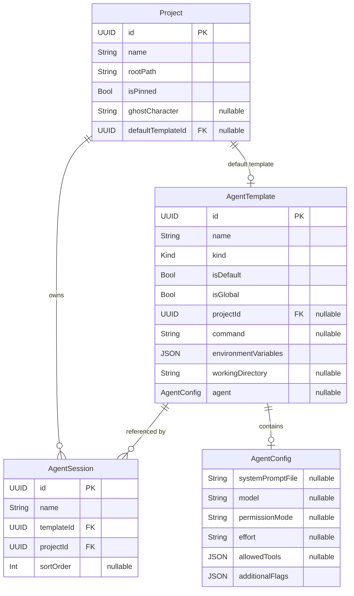

# feat: Agent-First Template System

## Overview

Replace `SessionTemplate` with an agent-first `AgentTemplate` model. Every session is an "agent" — Shell is just an agent with no AI config. Adds Claude Code agent configuration (system prompt, model, permissions) to templates with rebuild-from-template on every relaunch.

Brainstorm: `docs/brainstorms/2026-03-21-agent-templates-brainstorm.md`

## Problem Statement / Motivation

Today, launching a Claude Code session with a specific persona (orchestrator, frontend agent, review-only agent) requires manually typing CLI flags. There's no way to persist agent identity across session restarts, and no enforcement of agent boundaries (which model, which tools, which permissions). The existing `SessionTemplate` model only stores `command` and `environmentVariables` — insufficient for Claude Code agent configuration.

## Proposed Solution

### Phase 0: Investigate SurfaceConfiguration Command Handling (CRITICAL — do first)

**Before any code changes**, investigate how Ghostty's `SurfaceConfiguration` handles commands with arguments. This determines the entire CLI construction approach.

Current code path (`SessionCoordinator.createSession`, line 117):
```swift
config.command = resolvedCommand  // e.g., "/usr/local/bin/claude"
```

**Research needed:**
- Read `macos/Sources/Ghostty/Surface View/SurfaceView.swift` line 643+ for `SurfaceConfiguration`
- Check if there's an `argv` or `arguments` field
- Check upstream Ghostty source for how `config.command` is passed to the PTY (exec'd directly? through a shell?)
- Check if `initialInput` can be used to send a command after shell starts

**Expected outcomes:**
- **If SurfaceConfiguration supports an argument array**: Use it directly. `buildCommand()` returns `[String]`.
- **If command is exec'd directly (no args)**: Wrap in shell: `config.command = "/bin/zsh"`, pass full CLI via an environment variable or `initialInput`.
- **If command is passed through a shell**: Can use a single string with arguments. `buildCommand()` returns `String` with proper shell escaping.

This phase must complete before Phase 1 begins.

---

### Phase 1: Model + Persistence (no UI changes)

#### 1a. Create `AgentTemplate.swift` (replaces `SessionTemplate.swift`)

File: `macos/Sources/Features/Ghostties/Models/AgentTemplate.swift`

```swift
import Foundation

struct AgentTemplate: Identifiable, Codable, Hashable {
    let id: UUID
    var name: String
    var kind: Kind
    var isDefault: Bool
    var isGlobal: Bool
    var projectId: UUID?  // nil = global, non-nil = project-scoped

    // Terminal config
    var command: String?
    var environmentVariables: [String: String]
    var workingDirectory: String?

    // Agent config (nil for .shell)
    var agent: AgentConfig?

    enum Kind: String, Codable {
        case shell
        case claudeCode
        case custom
    }

    struct AgentConfig: Codable, Hashable {
        var systemPromptFile: String?
        var model: String?
        var permissionMode: String?
        var effort: String?
        var allowedTools: [String]?
        var additionalFlags: [String]

        init(systemPromptFile: String? = nil, model: String? = nil,
             permissionMode: String? = nil, effort: String? = nil,
             allowedTools: [String]? = nil, additionalFlags: [String] = []) {
            self.systemPromptFile = systemPromptFile
            self.model = model
            self.permissionMode = permissionMode
            self.effort = effort
            self.allowedTools = allowedTools
            self.additionalFlags = additionalFlags
        }
    }

    // MARK: - Built-in Templates (deterministic UUIDs)

    static let shell = AgentTemplate(
        id: UUID(uuidString: "00000000-0000-0000-0000-000000000001")!,
        name: "Shell", kind: .shell,
        isDefault: true, isGlobal: true
    )

    static let claudeCode = AgentTemplate(
        id: UUID(uuidString: "00000000-0000-0000-0000-000000000002")!,
        name: "Claude Code", kind: .claudeCode,
        command: "claude",
        isDefault: true, isGlobal: true
    )

    static let orchestrator = AgentTemplate(
        id: UUID(uuidString: "00000000-0000-0000-0000-000000000003")!,
        name: "Orchestrator", kind: .claudeCode,
        command: "claude",
        agent: AgentConfig(
            systemPromptFile: "~/.claude/orchestrator-prompt.md",
            model: "opus"
        ),
        isDefault: true, isGlobal: true
    )

    static let defaults: [AgentTemplate] = [shell, claudeCode, orchestrator]

    // MARK: - CLI Construction

    /// Build the command and arguments for launching this template.
    /// Returns (command, arguments) tuple. Command is resolved path,
    /// arguments are the CLI flags.
    func buildArguments() throws -> [String] {
        var args: [String] = []

        if let agent = agent {
            if let model = agent.model {
                args += ["--model", model]
            }
            if let promptFile = agent.systemPromptFile {
                let expandedPath = (promptFile as NSString).expandingTildeInPath
                let contents = try String(contentsOfFile: expandedPath, encoding: .utf8)
                args += ["--append-system-prompt", contents]
            }
            if let permissionMode = agent.permissionMode {
                args += ["--permission-mode", permissionMode]
            }
            if let effort = agent.effort {
                args += ["--effort", effort]
            }
            if let allowedTools = agent.allowedTools, !allowedTools.isEmpty {
                args += ["--allowedTools", allowedTools.joined(separator: ",")]
            }
            args += agent.additionalFlags
        }

        return args
    }

    // MARK: - Custom Codable (backward compat)

    // Custom init(from decoder:) handles:
    // 1. New format: kind, agent, projectId, isGlobal fields present
    // 2. Old SessionTemplate format: flat command/envVars, no kind/agent
    // Migration: command == nil → .shell, command == "claude" → .claudeCode, else → .custom
    // All old fields map to top-level (no terminal nesting in persistence)
}
```

**Key decisions:**
- `projectId: UUID?` added (SpecFlow Gap 8 — needed for project scoping)
- `buildArguments()` returns `[String]` not joined `String` (SpecFlow Gap 2 — avoids shell escaping)
- Tilde expansion via `(path as NSString).expandingTildeInPath` (SpecFlow Gap 3)
- `buildArguments()` is `throws` — caller handles file-not-found (SpecFlow Gap 6)
- Flat persistence (no nested `terminal` struct) — minimizes migration complexity
- Custom `init(from decoder:)` with backward-compat migration

---

#### 1b. Update `WorkspacePersistence.swift`

File: `macos/Sources/Features/Ghostties/WorkspacePersistence.swift`

Changes:
- `State.templates` type: `[SessionTemplate]` → `[AgentTemplate]`
- Custom decoder: try `[AgentTemplate]` first, fall back to `[SessionTemplate]` keys
- `Kind` enum decoded as raw String with safe fallback (reuse SidebarMode pattern)
- `AgentConfig` decoded with `decodeIfPresent` for all fields
- Validation: check `projectId` references, strip dangerous env vars, validate `allowedTools`

**Persistence migration field mapping:**
```
Old SessionTemplate    →    New AgentTemplate
─────────────────────────────────────────────
id                     →    id (unchanged)
name                   →    name (unchanged)
command                →    command (unchanged position)
environmentVariables   →    environmentVariables (unchanged)
isDefault              →    isDefault (unchanged)
(not present)          →    kind (inferred: nil→.shell, "claude"→.claudeCode, else→.custom)
(not present)          →    isGlobal (default: true)
(not present)          →    projectId (default: nil)
(not present)          →    workingDirectory (default: nil)
(not present)          →    agent (default: nil)
```

---

#### 1c. Update `WorkspaceStore.swift`

File: `macos/Sources/Features/Ghostties/WorkspaceStore.swift`

Changes:
- `@Published private(set) var templates: [AgentTemplate]`
- Startup merge: `AgentTemplate.defaults + customTemplates` (same pattern, new type)
- CRUD methods updated for new type
- Template filtering: `templates(for projectId:)` returns global + matching project templates
- Built-in templates remain immutable (guard stays)

---

#### 1d. Delete `SessionTemplate.swift`

Remove `macos/Sources/Features/Ghostties/Models/SessionTemplate.swift` after migration.

---

### Phase 2: Session Lifecycle (CLI construction + relaunch)

#### 2a. Update `SessionCoordinator.swift`

File: `macos/Sources/Features/Ghostties/SessionCoordinator.swift`

Changes to `createSession(session:template:project:)` (line 95):
- Accept `AgentTemplate` instead of `SessionTemplate`
- Call `template.buildArguments()` to get CLI flags
- **Based on Phase 0 findings**: either pass arguments via SurfaceConfiguration.argv, wrap in shell, or use initialInput
- Handle `buildArguments()` throwing (prompt file not found → launch without prompt, log warning)
- Pass `template.workingDirectory ?? project.rootPath` to SurfaceConfiguration

Error handling for prompt file not found:
```swift
do {
    let args = try template.buildArguments()
    // use args in SurfaceConfiguration
} catch {
    // Launch without agent config, show warning
    logger.warning("Agent template '\(template.name)' prompt file not found: \(error)")
    // Proceed with base command only
}
```

---

#### 2b. Update `ProjectDisclosureRow.swift`

File: `macos/Sources/Features/Ghostties/ProjectDisclosureRow.swift`

Changes to `relaunchSession()` (line 260):
- Resolve template as `AgentTemplate`
- If template deleted: show alert with option to pick new template or remove session (SpecFlow Gap 14)
- If prompt file missing: launch degraded + show warning

Changes to `handleNewSession()` (line 247):
- Resolve `project.defaultTemplateId` from `AgentTemplate` list
- If default template's prompt file doesn't exist: fall through to picker

---

### Phase 3: UI Updates

#### 3a. Update `TemplatePickerView.swift`

File: `macos/Sources/Features/Ghostties/TemplatePickerView.swift`

Changes:
- Type references: `SessionTemplate` → `AgentTemplate`
- Icon logic: replace `command == "claude"` heuristic with `kind`-based:
  - `.shell` → `"terminal"`
  - `.claudeCode` → `"sparkle"` (or `"cpu"` for agent-configured)
  - `.custom` → `"gearshape"`
- Agent config badge: show model name or prompt file indicator on agent-configured templates
- Template list: filter by current project (global + matching projectId)
- Section headers: "Built-in" / "Custom" / "Project" grouping
- Duplicate for built-ins: context menu shows "Duplicate and Edit..." instead of "Edit"

---

#### 3b. Update `TemplateEditForm` (within TemplatePickerView.swift)

Current fields: Name, Command, Environment Variables

New fields (shown conditionally based on kind):
- **Name** (all kinds) — TextField
- **Kind** (all) — Picker: Shell / Claude Code / Custom
- **Command** (claudeCode, custom) — TextField
- **Template Scope** (non-default) — Toggle: "Available in all projects" / "This project only"
- **Model** (when agent config shown) — Picker: opus / sonnet / haiku
- **System Prompt File** (when agent config shown) — TextField with file browse button (NSOpenPanel)
- **Permission Mode** (when agent config shown) — Picker: default / plan / auto / acceptEdits
- **Effort** (when agent config shown) — Picker: low / medium / high / max
- **Allowed Tools** (when agent config shown) — TextField (comma-separated)
- **Additional Flags** (when agent config shown) — TextField
- **Environment Variables** (all kinds) — TextEditor (KEY=VALUE lines)

Agent config section is visible when kind != .shell.

---

#### 3c. Update `ProjectSettingsView.swift`

File: `macos/Sources/Features/Ghostties/ProjectSettingsView.swift`

Changes:
- Default template picker: filter to show global + project templates
- Type reference: `SessionTemplate` → `AgentTemplate`

---

#### 3d. Update `WorkspaceSidebarView.swift`

File: `macos/Sources/Features/Ghostties/WorkspaceSidebarView.swift`

Changes:
- `createNewSessionForSelectedProject()` (line 149): align with `handleNewSession()` — use default if set, show picker if not (SpecFlow Gap 7, unify keyboard shortcut path)
- Fallback: `AgentTemplate.shell` instead of `SessionTemplate.shell`

---

### Phase 4: Tests

#### 4a. Update existing tests

File: `macos/Tests/Workspace/WorkspacePersistenceTests.swift`
- All `SessionTemplate` references → `AgentTemplate`
- Add test: old SessionTemplate JSON decodes into AgentTemplate
- Add test: AgentTemplate with AgentConfig round-trips correctly
- Add test: invalid Kind raw value defaults gracefully
- Add test: orphaned projectId cleanup

File: `macos/Tests/Workspace/AgentSessionTests.swift`
- Update `SessionTemplate.shell.id` → `AgentTemplate.shell.id`
- Update `SessionTemplate.claudeCode.id` → `AgentTemplate.claudeCode.id`

---

#### 4b. New tests

File: `macos/Tests/Workspace/AgentTemplateTests.swift` (new)
- `buildArguments()` returns correct flags for each kind
- `buildArguments()` expands tilde in prompt file path
- `buildArguments()` throws for missing prompt file
- Built-in template deterministic UUID stability
- `Kind` enum Codable round-trip
- `AgentConfig` Codable round-trip with optional fields

---

## Technical Considerations

### Architecture
- No upstream Ghostty files modified — this is entirely within `macos/Sources/Features/Ghostties/`
- Two-layer architecture preserved: WorkspaceStore (persistent) + SessionCoordinator (runtime)
- Built-in templates remain code-defined, never persisted. Custom templates persisted.

### Performance
- `buildArguments()` reads prompt file from disk on every relaunch. Files are small (<10KB). No caching needed.
- `resolveCommand()` cache continues to work — it resolves the base command path, not the full CLI.

### Security
- `additionalFlags` is an escape hatch that bypasses validation. Consider adding a basic blocklist (no `; && || |` characters) to prevent injection. Flag for future hardening.
- Prompt file contents visible in process args (`ps aux`). Acceptable for v1 — flag for future improvement (stdin passthrough).
- Env var sanitization already exists in `WorkspacePersistence.validate()` — extends to new model.

---

## Acceptance Criteria

### Functional Requirements
- [ ] AgentTemplate model with Kind enum, AgentConfig struct, all fields
- [ ] Three built-in defaults: Shell, Claude Code, Orchestrator
- [ ] Custom template CRUD (create, edit, duplicate, delete)
- [ ] Per-project template scoping (isGlobal + projectId)
- [ ] CLI construction from template config (buildArguments)
- [ ] Tilde expansion for prompt file paths
- [ ] Rebuild from template on session relaunch
- [ ] Graceful degradation when prompt file missing
- [ ] Alert when relaunching with deleted template
- [ ] Backward-compatible persistence migration from SessionTemplate JSON
- [ ] TemplateEditForm shows agent config fields conditionally

### Non-Functional Requirements
- [ ] All existing WorkspacePersistenceTests pass
- [ ] New AgentTemplateTests pass
- [ ] No upstream Ghostty files modified
- [ ] Build succeeds: `zig build -Doptimize=ReleaseFast`
- [ ] App launches without crash: `open macos/build/ReleaseLocal/Ghostties.app`

---

## Dependencies & Risks

| Risk | Impact | Mitigation |
|------|--------|-----------|
| SurfaceConfiguration doesn't support command arguments | Critical — blocks CLI construction | Phase 0 investigation. Fallback: shell wrapper. |
| Old workspace.json fails to decode | High — data loss | Defensive migration with decodeIfPresent + backup file |
| Prompt file contents break shell escaping | Medium — orchestrator template fails | Return [String] array, avoid shell joining |
| `--append-system-prompt` flag changes in future Claude Code versions | Low | additionalFlags escape hatch available |

---

## ERD — Model Changes



---

## References & Research

### Internal References
- Brainstorm: `docs/brainstorms/2026-03-21-agent-templates-brainstorm.md`
- Codable migration pattern: `docs/solutions/logic-errors/codable-enum-raw-value-wipes-state.md`
- Two-layer architecture: `docs/solutions/architecture/two-layer-state-architecture-swiftui-appkit-session-management.md`
- Code review checklist: `docs/solutions/logic-errors/sidebar-code-review-remediation.md`

### Key Code Locations
- `SessionTemplate.swift` (replace): `macos/Sources/Features/Ghostties/Models/SessionTemplate.swift`
- Session creation: `SessionCoordinator.swift:95` (createSession method)
- Command resolution: `SessionCoordinator.swift:382` (resolveCommand)
- Persistence: `WorkspacePersistence.swift:62-79` (custom decoder with migration patterns)
- Template merge: `WorkspaceStore.swift:49-52` (code-defined + persisted merge)
- Template picker: `TemplatePickerView.swift:22-37` (display), `154-263` (edit form)
- Relaunch: `ProjectDisclosureRow.swift:260` (relaunchSession)
- Keyboard shortcut: `WorkspaceSidebarView.swift:149` (createNewSessionForSelectedProject)
- SurfaceConfiguration: `SurfaceView.swift:643`
- Persistence tests: `Tests/Workspace/WorkspacePersistenceTests.swift`

### CLI Flags (verified 2026-03-21)
- `--model` — accepts aliases (opus, sonnet, haiku) or full names
- `--append-system-prompt` — inline string only (no file flag)
- `--permission-mode` — acceptEdits, bypassPermissions, default, dontAsk, plan, auto
- `--effort` — low, medium, high, max
- `--allowedTools` — comma/space-separated tool names
- `--disallowedTools` — blacklist version
- `--add-dir` — grant additional directory access
