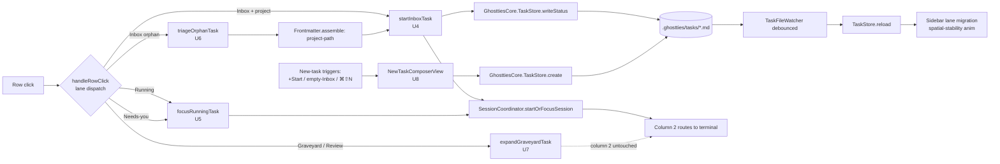

# feat: Row-click v0 — lane-aware dispatch + composer + triage + Graveyard expansion

> **Supersedes** `docs/plans/2026-04-25-feat-row-click-behavior-v0-plan.md` (pre-rework).
>
> Source of truth = origin doc + this plan. Linear tickets `SEA-156` (parent) and `SEA-157`–`SEA-168` (U1–U12) mirror this plan and are kept in sync with it.

---

## Overview

Replace today's overloaded row-click — which opens the task's `.md` externally **and** silently no-ops the terminal spawn for Linear-imported orphans — with a five-handler lane-aware router. Inbox click promotes (or triages, if orphan); Running / Needs-you focus the existing terminal; Graveyard / Review expand inline in column 1. Empty Inbox becomes a usable starting state via a layered new-task composer (header `[+ Start]`, empty-area click, `⌘⇧N`). Three-surface coherence preserved by routing all writes through `GhosttiesCore.TaskStore`. Adds a minimal `priority` slice (`high | medium | low | none`) for Inbox sort; visual surface is a glyph-only column on Inbox rows. Reshapes the click model around the brief's intent ("the sidebar is a queue of work, not references to browse") without violating spatial stability or the column-2-stays-terminal rule.

---

## Problem Frame

Today's `TaskRowView` click action does two unrelated things at once:

1. Opens the task's `.md` in the OS's default `.md` app (typically Obsidian / TextEdit), stealing focus.
2. Tries to spawn-or-focus a terminal at the task's project path — which silently no-ops when `project-path` is missing (the default for Linear-imported tasks).

So the typical Sean flow is: click row → external editor steals focus → no terminal appears → manually edit `.md` frontmatter to add `project-path` → click again. That's a silent-failure pattern, not a UX.

The brief's reframe — "the sidebar is a **queue of work**, not a list of references to browse" — picks intent-clarity over browse-safety. The disclosure triangle / inline expansion already serves the peek case; the primary click should mean "I'm picking this up and starting now." This v0 reshapes the click verb around that intent and bakes it into the existing column model: **column 1 navigates → column 2 executes → column 3 (browser) is auxiliary, untouched in v0.**

(See origin: `docs/brainstorms/2026-04-25-row-click-behavior-requirements.md` § Problem Frame.)

---

## Requirements Trace

- R1. Lane-aware click router → 5 named handlers.
- R2. Inbox-with-project click → `status: running` + spawn + route col 2.
- R3. Lane migration is file-watcher-driven, not direct UI mutation.
- R4. Inbox-orphan click opens an inline triage card (project picker + optional template + optional title).
- R5. Triage confirm writes `project-path` (+ optional `template`) and proceeds as F1.
- R6. Running click is idempotent: route col 2, focus cursor, no respawn.
- R7. Needs-you click identical to Running click in v0.
- R8. Graveyard click opens net-new per-row inline expansion in col 1; col 2 untouched.
- R9. Three layered new-task triggers — header `[+ Start]`, empty-Inbox-area click, `⌘⇧N` — open the same composer.
- R10. Composer rendered inline (not a sheet); fields = title (required), project (required), template (optional).
- R11. Confirm creates `.md` with `status: running`; watcher drives row appearance + spawn.
- R12. Three-surface coherence as design intent, not blocking rule. UI-only gestures exempt; data-semantic gestures should mirror to CLI/MCP.
- R13. `.md` opens externally only via the `📝` chip and `⌘O` — never on row click, never in-app.
- R14. Keyboard parity: `⌘⇧N` (composer), `⌘O` (open focused row's `.md`), `Return` (activate focused row). `j`/`k` row nav out of v0.
- R15. Frontmatter `priority` field (`high | medium | low | none`, default `none`); Inbox sorted by `priority desc, created desc`; `linear-sync` preset extended to map Linear's native priority. Composer does not surface priority.

**Origin actors:** A1 (Sean), A2 (coding agent), A3 (`gt` CLI), A4 (Ghostties MCP server).
**Origin flows:** F1 (Inbox-with-project click), F2 (Inbox-orphan click), F3 (Running click), F4 (Needs-you click), F5 (Graveyard click), F6 (new-task creation), F7 (open `.md` without starting).
**Origin acceptance examples:** AE1 (R2/R3), AE2 (R4/R5), AE3 (R6), AE4 (R8), AE5 (R9/R10/R11), AE6 (R13).

---

## Scope Boundaries

### Deferred for later

(Carried verbatim from origin — product/version sequencing.)

- **Soft-claim with TTL** (multi-actor coordination primitive). Right primitive, wrong moment for an audience of one.
- **Workspace context loading** (full task = terminal + branch checkout + editor + linked PR).
- **`⌘Z` to abort a just-started task / row-click undo.** Recovery via `exit` / edit `.md` / `gt done`. Idempotent re-click is focus-only, not undo.
- **Rich Graveyard read-mode** (col 3 markdown viewer or col 2 glow-style render). Decision based on real Graveyard usage.
- **Richer Inbox prioritization** — next-up indicators, urgency color, deadline-aware sort, learned priors. v0 ships only the minimal slice in R15.
- **Auto-pilot agents pulling from Inbox autonomously.** Wire exists today (`update_task_status`); the missing piece is the soft-claim safety primitive above.
- **`j`/`k` row navigation and other power-user keyboard.**
- **Project-as-mode (project view replacing task view).** Project labels remain row metadata only.

### Deferred to Follow-Up Work

- **Backlog and Review router branches** (per SG-04 in SEA-156). v0 ships no fixtures in those lanes; specifying click semantics now is invention without signal. Router unit (U3) explicitly leaves both as fall-throughs to log-and-noop with a TODO.
- **Toast component** for disk-write failure surfacing (per D13 in SEA-156). v0 ships row-error chip only; toast layer added when a second disk-write surface needs it.
- **`gt set-project` CLI subcommand** (per SEA-156 cuts). MCP `task.set_project` ships in U9 for agent / preset use; the CLI gap is acceptable for v0.
- **Cross-window IPC for "task is running in another window"** (per ADV-003). v0 silently no-ops in window B; double-spawn is acceptable for an audience of one.
- **`⌘Z` undo** wired through `gt status` or equivalent. Origin defers; not in v0.

### Outside this product's identity

(Carried from origin — positioning rejection.)

- **In-app `.md` viewer.** Either lives in column 2 (violates terminal-only contract) or column 3 (premature; col 3 is browser pane). External via `NSWorkspace.shared.open` keeps v0 small.
- **App-side AI-driven Inbox triage / smart-grouping.** The architectural pivot (2026-04-23 late) settled this: no agentic layer in-app. Smart triage happens in the user's own agent via `linear-sync`-style prompt presets.

---

## Context & Research

### Relevant Code and Patterns

- `macos/Sources/Features/Ghostties/TaskStore.swift` — currently read-only on the macOS side. `import GhosttiesCore` already added (commit `1ceef19d5`); write APIs land here in U2.
- `macos/Sources/Features/Ghostties/TaskFileWatcher.swift` — debounced file watcher; drives all lane migration. Per origin, watcher tunings are assumed adequate; verify under load during U4.
- `macos/Sources/Features/Ghostties/TaskRowView.swift` — current click action is overloaded. **No existing disclosure / expansion affordance** — Graveyard expansion (U7) is net-new UI.
- `macos/Sources/Features/Ghostties/SessionCoordinator.swift` — async `startOrFocusSession(at:taskId:)` with resolved-paths cache + 3s timeout. Reused for all spawn-or-focus paths. **Do not regress to synchronous spawn** (prior incident — `Process.waitUntilExit()` froze the UI).
- `macos/Sources/Features/Ghostties/TaskSidebarView.swift` and `Needs/Active/InboxZoneView.swift`, `ArchiveZoneView.swift` — sidebar composition. The composer + triage card render as inline slots inside Inbox; Graveyard expansion renders inside `ArchiveZoneView`.
- `cli/Sources/GhosttiesCore/TaskStore.swift` — already has `Frontmatter.assemble`, `store.write`, `store.create`. macOS wrappers in U2 thin-wrap these.
- `cli/Sources/ghostties-mcp/Tools/CreateTask.swift` — **already exists** (per F-001). U9 audits/extends, does not create.
- `cli/Sources/ghostties-mcp/Tools/Tools.swift:175` — existing `priorityEnum = [low, normal, high]`. U1 updates to `[high, medium, low, none]` (F-002).
- `macos/Ghostties.xcodeproj/project.pbxproj` lines 318 and 501 — `GhosttiesCore` product dependency already linked into the macOS target (Wave 2c). **No pbxproj edits in U2** (F-003).
- `MainMenu.xib` — for `⌘O` and `Return` row-action menu items (`⌘N` collides per F-004; see D17).

### Institutional Learnings

- `docs/solutions/logic-errors/codable-enum-raw-value-wipes-state.md` — strict-rawValue parser with `?? .default` skip. Pattern for U1's `TaskPriority(rawValue:) ?? .none`.
- `docs/solutions/logic-errors/phase-4-ghostties-workspace-sidebar-review.md` — **P1-001** multi-window notification scoping (filter by `coordinator.containerView?.window`); **P2-004** surface-close `DispatchQueue.main.async` defer. Both load-bearing for U4 / U12.
- `docs/solutions/logic-errors/sidebar-code-review-remediation.md` — gesture ordering rule (`onTapGesture(count: 2)` declared before count: 1 or it dies silently); async work off `@MainActor` via `Task.detached`. Relevant if U7 ever adds double-click rename.
- `docs/solutions/architecture/two-layer-state-architecture-swiftui-appkit-session-management.md` — Layer 1 persistent store + Layer 2 per-window coordinator. Pattern for U2's macOS write wrappers + multi-window scoping in U4 / U12.
- `docs/solutions/architecture/sidebar-3-state-machine-overlay-pattern.md` — when transitioning sidebar constraints, deactivate-then-activate. Relevant if composer / triage card inline rendering ever interacts with the sidebar's pinned/closed/overlay modes.

### External References

None. Codebase patterns are sufficient and well-grounded; the brief + design-pass addendum cover all UX-shape decisions.

---

## Key Technical Decisions

- **D1. macOS write capability via `import GhosttiesCore` + thin wrappers — pbxproj already done.** Wave 2c (2026-04-23) added the `GhosttiesCore` product dependency to the macOS target (pbxproj lines 318 and 501; two existing files already `import GhosttiesCore`). U2 only adds the import to `TaskStore.swift` and write wrappers. No pbxproj surgery. (Per F-003 + ADV-001 in SEA-156. Resolves origin's "macOS TaskStore is currently read-only" Deferred-to-Planning question.)

- **D2. Keep `update_task_status` MCP tool name unchanged. No `task.promote` rename.** Origin R12 framing — `update_task_status` already covers Inbox-promote semantics. Renaming would force a migration on every preset and agent already using the tool. (Resolves origin's "How does gt CLI map to task.promote" question.)

- **D3. New-task `id` = slugified-title + 8-char hex suffix from UUIDv4.** Confirms uniqueness under fast composer use without UUID-only filenames (which lose human-readability in `ls .ghostties/tasks/`). Exact slug algorithm — read existing fixture filenames during U8 implementation.

- **D4. Inline-attach grammar = Push, single-expansion-per-lane, intra-zone reflow only.** Lane zone heights are sacred (Needs-you / Active / Inbox / Archive); row positions **within** a zone are not. Pushing rows below the anchor inside one lane is the same shape of intra-zone change Inbox already absorbs when MCP rows arrive. Applies to: composer (in populated Inbox), triage card, Graveyard expansion. Cross-lane multiple-open allowed. (Today's design pass — supersedes any conflicting "overlay vs replace" framing in SEA-156 origin.)

- **D5. Composer placement.** Replaces empty-Inbox canvas in place when Inbox is empty (no rows below to push). When Inbox has rows, composer renders at top of Inbox lane and pushes Inbox rows down; Inbox scrolls internally if it overflows. Lane zone height preserved either way. (Today's design pass.)

- **D6. Project picker — split decision.** Triage card project picker = required, no smart-default (orphan-by-definition has no cwd or MRU to draw from). Composer project picker = required, smart-defaulted to (cwd of frontmost terminal session) → (most-recently-used project) → (most-recently-touched project in `WorkspaceStore.projects`). One-keystroke confirm for the common case; downstream click handlers still get the required-field guarantee. (Today's design pass — supersedes the SEA-156 framing of "composer optional with cwd default + MRU fallback"; functional UX is identical; the difference is presentation as a populated-required field rather than a free-floating default.)

- **D7. Empty `WorkspaceStore.projects` → composer is the onboarding.** Project picker shows `Add a project to begin   [+ Add project…]` as its only valid value; clicking the chip triggers `NSOpenPanel`, inserts the result, auto-selects it, and the composer continues into task creation. Title and template inert until a project is added. No separate first-run modal. (Today's design pass.)

- **D8. Killed/exited terminal during Running click → respawn at `project-path`.** Status stays `running`. Surface-close handler later migrates to Graveyard via the existing path (not this handler's job). (Resolves origin's "Killed/exited terminal during idempotent Running click" question.)

- **D9. Multi-window race → silent no-op in window B.** Cross-window IPC deferred entirely. Click in window B on a Running row whose live session is in window A respawns locally in B. Acceptable v0 behavior; double-spawn for an audience of one. (Per ADV-003 in SEA-156. Replaces the origin's "scope multi-window via P1-001 notification filtering" framing — the file-driven lane migration in B is fine; spawn must not fire in B unless the user explicitly clicks the row in B.)

- **D10. Graveyard expansion re-click toggles** (collapse → expand). Per-row state. Cross-lane multiple-open allowed; same-lane only one open at a time (auto-collapses sibling). Click outside the expansion = leaves it open until re-clicked (peek rewards lingering). (Today's design pass.)

- **D11. Single-composer / single-triage-card rule.** Only one composer open at a time. Second `⌘⇧N` invocation focuses the existing composer's title field. Likewise for second triage card open — clicking another orphan row while a card is open closes the first and opens the second.

- **D12. Backlog and Review router branches deferred** (SG-04 in SEA-156). v0 ships no fixtures in those lanes; their click semantics are out of v0 scope. Router (U3) leaves both as fall-throughs to a no-op with a TODO log line.

- **D13. Disk-write failure UX = row-error chip only.** Toast deferred to follow-up work. Error chip on the row appears on write failure; clears on next successful write. Caller (handler) catches throwables from `GhosttiesCore.TaskStore` and renders the chip. (Per SEA-156 D13 update.)

- **D14. Click-during-animation guard = two mechanisms.** (a) `pointer-events: none` for the 180ms reveal/collapse animation window with `aria-busy="true"` (today's design pass). (b) Per-`taskId` 400ms post-write debounce — plain timer, no per-task callback (drop "or until watcher confirms" since no per-task callback exists; per ADV-002 in SEA-156). Both can coexist: 180ms during animation, 400ms after write to swallow rapid re-clicks.

- **D15. Surface-close race wrapped in `DispatchQueue.main.async`.** Per `docs/solutions/logic-errors/phase-4-ghostties-workspace-sidebar-review.md` P2-004. When a terminal exits and the row should auto-migrate, status-flip handlers wrap in main-async.

- **D16. Permissive-with-default parsing for new enum values.** `priority` parses via `TaskPriority(rawValue:) ?? .none`. Unknown future values do not wipe state. Note that this is the strict-rawValue-with-skip pattern, not the Codable cite the origin doc accidentally invoked (origin FYI-7); strict-with-skip is the actual macOS `TaskStore` parser pattern.

- **D17. Keyboard shortcut: `⌘⇧N` for New Task.** `⌘N` collides with Ghostty's `new_window` shortcut via `syncMenuShortcut` (per F-004 in SEA-156). Implementation: `NSEvent.addLocalMonitorForEvents(matching: .keyDown)` scoped to sidebar key focus. (Replaces R9's original `⌘N` framing.)

- **D18. Animation grammar** (today's design pass):

| Phase                          | Property                           | Duration | Easing                         |
| ------------------------------ | ---------------------------------- | -------- | ------------------------------ |
| Anchor row settle              | bg-opacity, left-rule fade-in      | 120ms    | ease-out                       |
| Panel reveal (height)          | 0 → measured                       | 180ms    | cubic-bezier(0.2, 0.7, 0.2, 1) |
| Panel content fade-in          | opacity 0 → 1 (starts 60ms in)     | 140ms    | ease-out                       |
| Rows-below push                | y-translate (parent height-driven) | 180ms    | shares panel-reveal curve      |
| Graveyard chevron rotation     | 0 → 90deg                          | 160ms    | ease-out                       |
| Collapse (close, all surfaces) | reverse, no content fade           | 140ms    | ease-in                        |

No pulse, no glow, no spring overshoot. Calm settle.

- **D19. Reduced-motion = opacity crossfade only at 200ms; height/translate/rotate animations short-circuit to instant.** Final positions snap; never freeze mid-state. (Per DL-003 in SEA-156, ack'd via the rework bundle. Resolves origin "reduced-motion behavior for spatial-stability animation" gap.)

- **D20. Terracotta budget rule.** Brief reserves terracotta for "Needs-you state and active-task emphasis." v0 expands minimally to mark **active write in progress on a row**, but only via two specific surfaces:
  - **Allowed:** 2px terracotta left-rule on the **anchor row** of an open triage card. Marks the row, which is the load-bearing object.
  - **Allowed:** terracotta-tinted text on `[+ Add project…]` chip inside the composer's project picker, **only** when `WorkspaceStore.projects` is empty. First-run unblock moment.
  - **Not allowed:** focus ring on composer title input (use `rgba(255,255,255,0.40)` chrome border); composer Start button (use white-chrome solid); Graveyard expansion anchor row (neutral white left-rule); priority glyph slot (no color, see D21); `[+ Start]` button itself (low-contrast chrome).

- **D21. Priority visual treatment.** Glyph-only, monospaced, fixed 12px leading slot:

| Priority | Glyph | Weight                | Opacity (dark) | Opacity (light) |
| -------- | ----- | --------------------- | -------------- | --------------- |
| High     | `▲`   | SF Mono Semibold 11pt | 85%            | 78%             |
| Medium   | `▴`   | SF Mono Semibold 11pt | 55%            | 50%             |
| Low      | `▾`   | SF Mono Semibold 11pt | 40%            | 38%             |
| None     | `·`   | SF Mono Regular 11pt  | 22%            | 25%             |

All four states occupy the same 12px slot; flipping a priority never reflows the row. `none` gets a real glyph so default rows look quiet by design, not broken. **Lane-scope = Inbox only** in v0; Running / Needs-you / Graveyard rows do not render the priority glyph. Linear's `Urgent` collapses into `High` (Linear's urgency channel for Ghostties is the Needs-you lane + terracotta, not a 5th priority tier). (Today's design pass.)

- **D22. `[+ Start]` button placement.** Top-right of sidebar header strip, sticky, low-contrast chrome (`rgba(255,255,255,0.08)` background, no terracotta). Always visible. Independent element from the composer (button is a trigger; composer is a separate inline surface). (Per DL-005 + today's design pass.)

- **D23. Composer copy.** Title placeholder "What are you starting?". Project micro-label "in" (lowercase, all-caps via styling). Template micro-label "via". Primary action `Start ↵` (no play-triangle — wrong metaphor for CLI spawn). Cancel = small `esc` keychip + "cancel" hint at 32% white (escape hatch, not a button). Empty-Inbox primary "Nothing in the inbox." Empty-Inbox secondary "Click anywhere here to start a new task." No emojis. (Today's design pass.)

- **D24. Graveyard chevron — Graveyard-only column.** Net-new 14px leading slot, **only on Graveyard / Review rows** (does not waste a column on Inbox / Running / Needs-you rows). `›` collapsed (0deg, opacity 0.45) → `⌄` open (rotated 90deg). 11pt SF Mono. Implemented as a nullable leading slot in the row component, or a Graveyard-specific row variant — pick during U7 implementation; both are cheap. (Today's design pass.)

- **D25. Click-outside-to-close.** Triage card = yes (cancel without write — write-flow demands intent). Graveyard expansion = no (peek rewards lingering — re-click chevron or another Graveyard row to close). Composer = yes via `Esc` (not click-outside; `⌘⇧N` while open re-focuses, not a second composer per D11). (Today's design pass.)

- **D26. Flat directory layout in `macos/Sources/Features/Ghostties/`.** No `RowClick/`, `Triage/`, `Composer/`, `Graveyard/` subdirs (per SG-05 in SEA-156). Files use clear name prefixes: `RowClickRouter.swift`, `RowClickHandlers.swift`, `OrphanTriageCardView.swift`, `NewTaskComposerView.swift`, `GraveyardRowExpansionView.swift`, etc.

- **D27. MCP `priorityEnum` migration.** Existing MCP tool defines `priorityEnum` at `cli/Sources/ghostties-mcp/Tools/Tools.swift:175` as `[low, normal, high]`. U1 updates to `[high, medium, low, none]`. Pre-migration audit step: confirm zero on-disk fixture tasks use `priority: normal` (no fixture currently exposes `priority`, so audit is expected to be zero hits). (Per F-002 in SEA-156. Resolves origin "MCP priority enum mismatch" P0.)

- **D28. `task.create` MCP tool already exists** at `cli/Sources/ghostties-mcp/Tools/CreateTask.swift`. U9 audits existing implementation against the v0 contract (priority field, source field, project required) and extends — does NOT create a new file. (Per F-001 in SEA-156. Resolves origin "task.create ships in parallel" P0.)

- **D29. Linear's `Urgent` priority maps to `high`** in `linear-sync` preset (per R15). `Urgent` / `High` → `high`; `Medium` → `medium`; `Low` → `low`; `No priority` → `none`. The collapse is intentional (D21 rationale).

---

## Open Questions

### Resolved During Planning

- **File watcher / click handler interaction race** → D14 + write-only UI principle. Watcher is single source of UI truth; handlers don't mutate sidebar state directly.
- **Triage card UI shape** → D4 push, single-per-lane.
- **Composer file naming** → D3 slug + UUIDv4 short suffix.
- **gt/MCP `task.promote` mapping** → D2 no rename; reuse `update_task_status`.
- **macOS TaskStore architecture** → D1 already linked; just import + wrappers.
- **TaskRowView expansion affordance** → D24 net-new 14px chevron slot, Graveyard-only column.
- **Disk-write failure UX** → D13 row-chip-only; toast deferred.
- **Click-during-animation race** → D14 dual mechanism (180ms pointer-events guard + 400ms post-write debounce).
- **Empty WorkspaceStore.projects** → D7 composer is onboarding.
- **Backlog / Review semantics** → D12 deferred.
- **Spatial mechanics (triage / composer / Graveyard)** → D4 unified push grammar.
- **`[+ Start]` placement** → D22 top-right header sticky.
- **Empty states for non-Inbox lanes** → SG-03: Inbox-only empty state in v0; Running / Needs-you / Graveyard hide when empty.
- **Required vs optional project picker** → D6 split (triage required; composer required + smart-default).
- **Multi-window watcher race** → D9 silent no-op in B.
- **Killed / exited Running click** → D8 respawn.
- **`⌘N` collision with Ghostty `new_window`** → D17 use `⌘⇧N` via `NSEvent` local monitor.
- **Reduced-motion behavior** → D19 opacity crossfade 200ms, no position animation.
- **Terracotta budget for new UI** → D20 two surfaces only.
- **Priority visual treatment** → D21 glyph-only, Inbox-only, no color.

### Deferred to Implementation

- **Exact slug algorithm for D3** — read existing fixture filenames during U8 implementation; pick the algorithm that matches existing `.md` names if the convention is consistent.
- **Whether to add `gt set-project` CLI subcommand or extend `gt edit`** — decide during U10 based on `gt` UX cohesion. SEA-156 puts `gt set-project` in Deferred to Follow-Up Work; if U10 implementation surfaces a low-cost extension to an existing verb, take it.
- **Composer microcopy beyond the locked strings** — minor refinements settle with Sean during implementation review.
- **Body-preview line-clamp tightness for Graveyard expansion** — origin says ~8 lines; tune from real `.md` content during U7 (consider belt-and-suspenders px-cap at e.g. 128px to prevent very-long single-line wraps blowing out the panel).
- **MRU project tracking storage** — UserDefaults vs in-memory only. Decide during U6 / U8 based on cross-session expectation; UserDefaults is the safer default for "feels remembered."
- **`📝` chip presence in `TaskRowView`** — confirm it's already shipped (pre-existing chip per origin R13); if not, add as part of U11 alongside the `⌘O` shortcut.
- **`OrphanTriageStore` vs holding triage state on `TaskStore` directly** — pick during U6 implementation; pattern depends on whether triage state needs to persist across sidebar re-renders.

---

## High-Level Technical Design

> _This illustrates the intended approach and is directional guidance for review, not implementation specification. The implementing agent should treat it as context, not code to reproduce._

**Architectural principle:** UI is **write-only** to disk. Disk is the single source of truth. File-watcher drives all sidebar lane migration. Click handlers never mutate sidebar state directly. Three-surface coherence (gt / MCP / macOS app) preserved by routing all writes through `GhosttiesCore.TaskStore`.

---

## Implementation Units

> Critical path: **U1 → U2 → U3 → (U4 ‖ U5) → (U6 ‖ U7 ‖ U8) → (U9 ‖ U10 ‖ U11) → U12.** Three parallel waves possible after U3 / U2 lands.

### Phase 1 — Foundation (sequential)

- [ ] U1. **Frontmatter `priority` field + MCP enum migration**

**Goal:** Add `priority: high | medium | low | none` to the task schema across all three surfaces; default `.none`. Update existing MCP `priorityEnum` from `[low, normal, high]` to the new values. Inbox sort by `priority desc, created desc`. UI-side priority editing is out (per D21 — composer doesn't surface it; Inbox-only visual).

**Requirements:** R15.

**Dependencies:** None.

**Files:**

- Modify: `cli/Sources/GhosttiesCore/Frontmatter.swift` — add `priority` parse + serialize.
- Modify: `cli/Sources/GhosttiesCore/Task.swift` — add `priority: TaskPriority` property; `enum TaskPriority: String, Codable { case high, medium, low, none }`.
- Modify: `cli/Sources/ghostties-mcp/Tools/Tools.swift` (line 175) — update `priorityEnum` from `["low", "normal", "high"]` to `["high", "medium", "low", "none"]` (D27 / F-002).
- Modify: `macos/Sources/Features/Ghostties/TaskModel.swift` — mirror `TaskPriority` (until U2 collapses macOS type to a typealias of `GhosttiesCore.TaskPriority`).
- Modify: `macos/Sources/Features/Ghostties/TaskStore.swift` — extend the existing fixture parser to parse `priority` via `TaskPriority(rawValue:) ?? .none` (strict-with-skip per D16).
- Modify: `macos/Sources/Features/Ghostties/TaskSidebarView.swift` (or wherever Inbox sorting lives — confirm during impl) — extend Inbox sort to `priority desc, created desc`.
- Modify: `macos/Resources/presets/linear-sync/system.md` — add Linear-priority mapping section per D29 (lands schema-side here; preset-text content can also land in U10 to keep U1 focused).
- Test: `cli/Tests/GhosttiesCoreTests/FrontmatterTests.swift` — round-trip priority across all four values + missing case + unknown value.
- Test: `macos/Tests/Ghostties/TaskFixtureParserTests.swift` (or wherever the fixture parser tests live — confirm during impl) — same coverage on the macOS side.
- Test: `cli/Tests/GhosttiesMCPTests/MCPProtocolTests.swift` — assert the new `priorityEnum` values are advertised in `task.create` and any other tools that accept priority.

**Approach:**

- D16: parse permissively. Missing or unknown values → `.none`. Adding higher levels later doesn't wipe state.
- Three-surface coherence test extends to assert `priority` round-trips through gt / MCP / macOS writes.
- Pre-migration audit (D27): confirm zero on-disk fixture tasks use `priority: normal` (currently no fixture exposes `priority`; expect zero hits).

**Patterns to follow:**

- `cli/Sources/GhosttiesCore/Task.swift` `TaskStatus` enum and its parsing.
- `docs/solutions/logic-errors/codable-enum-raw-value-wipes-state.md` (strict-with-skip pattern).

**Test scenarios:**

- _Happy path:_ parse `priority: high` → `.high`; `priority: medium` → `.medium`; `priority: low` → `.low`; `priority: none` → `.none`.
- _Edge case:_ missing `priority` key → defaults to `.none`. Empty string → `.none`. Whitespace-only → `.none`.
- _Edge case:_ unknown value (`priority: urgent`, `priority: normal` from a stale fixture) → `.none` (no crash, no rejection of the rest of the file).
- _Edge case:_ Inbox sort with mixed priorities — high above medium above low above none; within each priority, newest first by `created`.
- _Integration:_ `Frontmatter.assemble` round-trips all four levels without loss when re-parsed.
- _Integration:_ a fixture `.md` with `priority: high` parses identically through gt CLI, MCP, and macOS `TaskFixtureParser` (cross-surface coherence).
- _Integration:_ MCP `task.create` with `priority: high` produces an on-disk file readable by the other two surfaces.

**Verification:**

- All three surfaces parse and (where applicable) write `priority`. Round-trip tests pass. Existing tasks without `priority` still load and lane-migrate correctly. MCP tool advertises `[high, medium, low, none]`.

---

- [ ] U2. **`import GhosttiesCore` + write wrappers in macOS `TaskStore`**

**Goal:** Make macOS `TaskStore` write-capable by `import GhosttiesCore` + thin wrapper methods. Enables U4 / U6 / U8.

**Requirements:** R2, R5, R11. (Origin Deferred-to-Planning: macOS `TaskStore` is currently read-only.)

**Dependencies:** U1 (schema changes land first to keep the package consistent).

**Files:**

- Modify: `macos/Sources/Features/Ghostties/TaskStore.swift` — `import GhosttiesCore` (already in via commit `1ceef19d5`; verify). Add:
  - `func writeStatus(_ status: TaskStatus, for taskId: String) async throws`
  - `func writeProjectPath(_ path: String, for taskId: String) async throws`
  - `func createTask(...) async throws -> Task` — parameters: title, projectPath, template?, priority? (default `.none`), source? (default `.shell`).
  - All three thin-wrap `GhosttiesCore.TaskStore` (which already has `Frontmatter.assemble`, `store.write`, `store.create`).
- Modify: `macos/Sources/Features/Ghostties/TaskModel.swift` — typealias macOS `TaskStatus` / `TaskPriority` to the `GhosttiesCore` types if signatures match cleanly. **If signatures don't match, keep two enums** + add the static-bridge test below (per ADV-007 in SEA-156). The recent `Swift.Task` vs `GhosttiesCore.Task` collision (commit `1ceef19d5`) is a smell that the typealias path may have collisions; if so, keep the parallel enums and rely on the bridge test to enforce raw-value parity.
- Test: `macos/Tests/Ghostties/TaskStoreWriteTests.swift` (new, IDE-only — CI macos job is build-only per ORCHESTRATOR.md).
- Test: `macos/Tests/Ghostties/TaskTypeBridgeTests.swift` (new, IDE-only) — assert `TaskStatus.allCases` raw values are a subset of `GhosttiesCore.TaskStatus` raw values; same for `TaskPriority.allCases` vs `GhosttiesCore.TaskPriority`.

**⚠️ Plan-revision note (D1 / F-003 / ADV-001):**

The original plan said this unit modifies the pbxproj. **It does not.** `GhosttiesCore` is already linked into the macOS target by Wave 2c (2026-04-23):

- `macos/Ghostties.xcodeproj/project.pbxproj` line 318: `GhosttiesCore in Frameworks` (build phase `A5B3052E299BEAAA0047F10C`).
- pbxproj line 501: `packageProductDependencies` for the Ghostties target.
- Two macOS files already `import GhosttiesCore` (`MCPSourceSettingsStore.swift`, `AddMCPSourceSheet.swift`).

**Do NOT touch the pbxproj.** Avoids Fragile Area #16 churn.

**Approach:**

- Wrap `GhosttiesCore.TaskStore` operations in `async throws` macOS-side methods so calls from click handlers (U4 / U6 / U8) read naturally.
- Permission failures, sandbox issues, atomic-rename failures must surface as throwable errors (not silently absorbed). Caller (D13) renders the error chip.
- Multi-window safety (Layer 2 in two-layer state pattern from `docs/solutions/architecture/two-layer-state-architecture-swiftui-appkit-session-management.md`): `TaskStore` is the persistent layer; per-window coordination remains in `SessionCoordinator`.

**Execution note:** Build with `ONLY_ACTIVE_ARCH=YES ARCHS=arm64` (Fragile Area #4). New tests are IDE-only (CI macOS job is build-only).

**Patterns to follow:**

- `cli/Sources/GhosttiesCore/TaskStore.swift` write API — `Frontmatter.assemble`, `store.write`, `store.create`.
- Existing `MCPSourceSettingsStore.swift` for the `import GhosttiesCore` pattern.

**Test scenarios:**

- _Happy path:_ `writeStatus(.running, for: id)` updates the `.md`; macOS read confirms round-trip.
- _Happy path:_ `createTask(title: "x", projectPath: "~/Code/ghostties")` produces an on-disk file; `TaskFileWatcher` picks up the change.
- _Error path:_ write to a sandboxed/read-only directory throws a typed error (no silent absorption).
- _Error path:_ atomic-rename collision with concurrent writer (simulated) throws cleanly without corrupting the file.
- _Bridge:_ every macOS `TaskStatus.allCases` raw value exists in `GhosttiesCore.TaskStatus.allCases`. Same for `TaskPriority`.
- _Integration:_ gt CLI writes a task → macOS reads via `TaskStore` → identical frontmatter (cross-surface coherence catches enum drift).

**Verification:**

- `import GhosttiesCore` compiles in macOS target. macOS module can write `.md` files. Existing read-path tests remain green. CLI cross-surface coherence test still passes.

**Blocks:** U3, U4, U6, U8.

---

- [ ] U3. **Click router skeleton — `handleRowClick(task)` lane dispatch**

**Goal:** Stand up the dispatch surface that all five handlers will plug into, with stub implementations for each lane. Existing `TaskRowView` click action is rewired to call the router. Ships with existing behavior preserved (so `main` doesn't regress mid-stack); subsequent units replace each stub with a real handler. Backlog / Review fall through to log-and-noop with a TODO (D12).

**Requirements:** R1.

**Dependencies:** U2 (router will need write APIs in subsequent units; landing the skeleton on top of U2 keeps the stack additive).

**Files:**

- Create: `macos/Sources/Features/Ghostties/RowClickRouter.swift` (flat layout per D26).
- Create: `macos/Sources/Features/Ghostties/RowClickHandlers.swift` — stubs for `startInboxTask`, `triageOrphanTask`, `focusRunningTask`, `focusNeedsYouTask`, `expandGraveyardTask`. Plus fall-throughs for Backlog / Review that log-and-noop.
- Modify: `macos/Sources/Features/Ghostties/TaskRowView.swift` — replace existing tap action with `RowClickRouter.shared.handleRowClick(task)` (or `@EnvironmentObject` injection if ownership analysis says so during impl).
- Test: `macos/Tests/Ghostties/RowClickRouterTests.swift` (new, IDE-only) — dispatch correctness for each lane × project-context combination.

**Approach:**

- The router is a `switch` on a derived `lane` value, not stored state. `lane` derives from `task.status` + `hasProjectContext(task)` — returns `true` if `project-path` is set or `project` resolves via `WorkspaceStore.projects`.
- Stubs in U3 preserve current behavior: `startInboxTask` calls the existing tap action; the others are no-ops with TODO logs. Keeps `main` shippable mid-stack.
- Router is `@MainActor` per existing convention for sidebar state objects.
- Backlog / Review fall through to a single `unhandledLane(task, lane)` no-op that logs the lane name and does nothing else (D12 — deferred until v0 ships fixtures in those lanes).

**Patterns to follow:**

- Existing dispatch in `WorkspaceStore` / `SessionCoordinator` — `@MainActor` + actor-isolated state.

**Test scenarios:**

- _Happy path:_ row in Inbox with `project-path` set → router calls `startInboxTask`.
- _Happy path:_ row in Inbox without `project-path` and no resolvable `project` → router calls `triageOrphanTask`.
- _Happy path:_ row with `status: running` → router calls `focusRunningTask`.
- _Happy path:_ row with `status: needs-you` → router calls `focusNeedsYouTask`.
- _Happy path:_ row with `status: done` → router calls `expandGraveyardTask`.
- _Edge case:_ row with `status: backlog` → router calls `unhandledLane` (Backlog deferred per D12).
- _Edge case:_ row with `status: review` → router calls `unhandledLane` (Review deferred per D12).
- _Edge case:_ project resolution path — `project` field set, `project-path` missing, and `WorkspaceStore.projects` contains a matching name → `startInboxTask` (project context present via resolution).
- _Edge case:_ same `project` name but `WorkspaceStore.projects` doesn't contain it → `triageOrphanTask`.

**Verification:**

- Router dispatches correctly for every lane × project-context combination. Existing Inbox-with-project click behavior is preserved. Stub handlers log their invocation so the next units can replace them surgically. Backlog / Review log-and-noop.

**Blocks:** U4, U5, U6, U7, U8 (all need the router skeleton to plug into).

---

### Phase 2 — Core handlers (parallel after U3)

- [ ] U4. **`startInboxTask` — Inbox click with project context**

**Goal:** Replace the U3 stub with the real handler. Click writes `status: running` to frontmatter (via U2 write API), spawns/focuses the terminal session via `SessionCoordinator.startOrFocusSession`, routes column 2. File-watcher migrates the row to Running.

**Requirements:** R2, R3.

**Dependencies:** U2, U3.

**Files:**

- Modify: `macos/Sources/Features/Ghostties/RowClickHandlers.swift` — `startInboxTask` real implementation.
- Modify: `macos/Sources/Features/Ghostties/TaskStore.swift` — surface the write helper from U2 with the right error semantics.
- Modify: `macos/Sources/Features/Ghostties/SessionCoordinator.swift` — confirm `startOrFocusSession(at:taskId:)` signature accepts a `taskId` for binding (probably already does — verify in impl).
- Test: `macos/Tests/Ghostties/StartInboxTaskTests.swift` (new, IDE-only).

**Approach:**

- Handler is **write-only** w.r.t. UI state — the watcher is the single source of UI truth (R3).
- Per-`taskId` debounce (D14): set a "promotion in-flight" flag for 400ms; during that window, the row's click target is disabled. (Plain timer; no per-task callback.)
- Animation guard (D14): row's click target is disabled (`pointer-events: none`-equivalent in SwiftUI: `.allowsHitTesting(false)`) for the 180ms animation window.
- Multi-window safety (D9 + P1-001 from `docs/solutions/logic-errors/phase-4-ghostties-workspace-sidebar-review.md`): status-flip notifications are filtered by `coordinator.containerView?.window`. The file-driven lane migration in window B is fine; spawn must NOT fire in B unless the user explicitly clicks the row in B.
- Per D8: if `startOrFocusSession` reports the resolved-paths cache has a stale entry (terminal exited but row still says running), respawn at `project-path`.
- Per D13: write-failure → throws → caller renders row-level error chip.
- Per D15: status-flip handlers wrap in `DispatchQueue.main.async` (P2-004 surface-close defer).

**Execution note:** Do **not** revert to synchronous `Process.waitUntilExit()` — Dependencies/Assumptions item 1 in origin (prior incident froze UI).

**Patterns to follow:**

- `SessionCoordinator.startOrFocusSession` async path.
- `phase-4-ghostties-workspace-sidebar-review.md` P2-004 — `DispatchQueue.main.async` defer for status-flip notifications.

**Test scenarios:**

- _Covers AE1 / Happy path:_ Inbox row with `project-path: ~/Code/ghostties` clicked → `.md` shows `status: running`, terminal session spawns at the path, row migrates to Running, column 2 shows the new terminal.
- _Edge case (D14):_ rapid double-click on the same Inbox row → only one status-flip write, only one spawn. Second click within 400ms is no-op.
- _Edge case (D14):_ click row A then row B within 200ms → both fire (debounce is per-`taskId`, not global).
- _Edge case:_ click during animation window — `.allowsHitTesting(false)` swallows the click; no double-fire.
- _Error path (D13):_ write to `.md` fails (simulated `EACCES`) → no spawn, no migration, error chip appears on the row.
- _Error path:_ `startOrFocusSession` returns within 3s timeout but reports failure → row migrates (status was written) but column 2 shows session-spawn error state.
- _Integration:_ click → write → file-watcher fires → `TaskStore.reload` → row reappears in Running lane with the spatial-stability animation.
- _Integration (multi-window, D9 + P1-001):_ click in window A → window A's session, window A's column 2. Window B's watcher migrates the row to Running; clicking it in window B respawns locally in B (acceptable per D9).

**Verification:**

- AE1 passes by hand. Tests pass. The original silent-no-op pattern (Linear orphan tasks) is gone — orphan clicks now fall through to U6, not into a dead end.

---

- [ ] U5. **`focusRunningTask` and `focusNeedsYouTask` — Running + Needs-you click**

**Goal:** Replace U3 stubs. Both handlers route column 2 to the task's existing terminal session and focus the cursor. No status flip, no respawn (except D8 fallback), no auto-scroll.

**Requirements:** R6, R7.

**Dependencies:** U3. (Independent of U4 — these handlers don't write.)

**Files:**

- Modify: `macos/Sources/Features/Ghostties/RowClickHandlers.swift` — both handlers' real implementations.
- Test: `macos/Tests/Ghostties/FocusRunningTaskTests.swift` (new, IDE-only — covers both handlers since they're identical in v0).

**Approach:**

- `focusNeedsYouTask` calls `focusRunningTask` (or both share a private `routeToExistingSession(task)` helper). Origin explicitly says they're identical in v0.
- Per D8: if no live `SurfaceView` exists for the task (`exit`ed or crashed but `surface-close` handler hasn't fired), respawn at `project-path` — keep status as `running`. Don't auto-migrate to Graveyard.
- Lane membership for Needs-you is `task.status == .needsYou` (R7) — the live `isLikelyPromptingForInput` heuristic stays per-session indicator only. **No code change to the heuristic in this unit.**

**Patterns to follow:**

- `SessionCoordinator.startOrFocusSession` already handles "focus existing if present, spawn if not" — reuse that path.

**Test scenarios:**

- _Covers AE3 / Happy path (R6):_ click Running row → column 2 routes to the existing session, cursor focuses, no status flip, no respawn (assert spawn count unchanged).
- _Happy path (R7):_ click Needs-you row → column 2 routes to the existing session, cursor focuses. No auto-scroll asserted.
- _Edge case:_ idempotent re-click — clicking a Running row twice in succession produces zero spawns.
- _Edge case (D8):_ Running row whose live `SurfaceView` was closed by `exit` but `surface-close` handler hasn't fired → respawns at `project-path`, status stays `running`.
- _Edge case (D9):_ click in window B on a Running row whose live session lives in window A → respawns locally in B.

**Verification:**

- Tests pass. Manual: starting a task then clicking its Running row never spawns a duplicate. Needs-you row click routes column 2 without surprise.

---

### Phase 3 — Net-new column-1 UI (parallel after U2 — but U6 / U8 also depend on U4 for continuation flow)

- [ ] U6. **Orphan triage card + `triageOrphanTask`**

**Goal:** Net-new inline UI for clicking an Inbox row without project context. Card opens attached to the row (D4 push mechanic, single-per-lane); fields = project picker (required, no smart-default per D6), optional template picker, optional title edit. Confirm writes `project-path` (and optional `template`) to frontmatter, then continues as F1 (status flip, spawn, migrate).

**Requirements:** R4, R5, R12 (`task.set_project` MCP equivalence — see U9).

**Dependencies:** U2 (write API), U3 (router stub), U4 (continuation flow).

**Files:**

- Create: `macos/Sources/Features/Ghostties/OrphanTriageCardView.swift` — SwiftUI card (flat layout per D26).
- Create: `macos/Sources/Features/Ghostties/OrphanTriageStore.swift` — picker state + commit logic.
- Modify: `macos/Sources/Features/Ghostties/RowClickHandlers.swift` — `triageOrphanTask` real implementation.
- Modify: `macos/Sources/Features/Ghostties/TaskSidebarView.swift` — slot for the inline card attached to the active orphan row (D4 push mechanic).
- Modify: `macos/Sources/Features/Ghostties/Needs/Active/InboxZoneView.swift` (or equivalent — confirm during impl) — render the triage card slot inline when an orphan row is in triage state.
- Test: `macos/Tests/Ghostties/TriageOrphanTaskTests.swift` (new, IDE-only).

**Approach:**

- D4: card pushes Inbox rows below it down — same `.transition` family as lane migration. Anchor row gets 2px terracotta left-rule (D20-allowed). No overlay, no sheet.
- D6: project picker required, no smart-default (orphan-by-definition has no cwd or MRU to draw from).
- D7: empty `WorkspaceStore.projects` — picker shows `[+ Add project…]` chip with terracotta-tinted text (D20-allowed); clicking opens `NSOpenPanel` and inserts the result.
- D11: only one triage card open per lane. Clicking another orphan row while card open auto-collapses the first.
- D25: click outside the card cancels (no frontmatter write).
- D18: animation grammar — 180ms reveal, 140ms collapse, ease-out family.
- D19: reduced-motion → opacity crossfade only at 200ms.
- Confirm flow:
  1. Validate fields (project required, title non-empty if title was edited).
  2. Write frontmatter: `project-path`, optional `template`, optional renamed `title`.
  3. Call `startInboxTask(task)` (U4) for the rest of the flow.
  4. Close the card.
- Cancel flow: close card, no writes, row stays in Inbox.

**Patterns to follow:**

- Existing pickers in `WorkspaceSettings` for the project list rendering.
- Spatial-stability animation in `TaskSidebarView` for the push mechanic.

**Test scenarios:**

- _Covers AE2 / Happy path:_ orphan Inbox row clicked → triage card opens, project "ghostties" picked, confirm → `.md` updated with `project-path: ~/Code/ghostties`, status flips to `running`, terminal spawns, row migrates.
- _Happy path:_ optional template picker filled in → `.md` includes `template: <name>` after confirm.
- _Happy path:_ optional title edit → `.md` `title:` is rewritten before status flip.
- _Edge case:_ cancel via `Esc` → no writes, row stays in Inbox unchanged. (Failure path of F2.)
- _Edge case (D25):_ click outside the card → cancels (no writes).
- _Edge case (D11):_ click orphan row A → card opens. Click orphan row B without confirming → row A's card closes, row B's card opens.
- _Edge case (D7):_ `WorkspaceStore.projects` empty → `[+ Add project…]` chip with terracotta-tint visible; clicking opens `NSOpenPanel`; selecting a folder inserts and auto-selects it.
- _Error path (D13):_ frontmatter write fails → row gets error chip, card stays open showing the error, no spawn.
- _Edge case (D18 / D19):_ animation respects `accessibilityReduceMotion` — opacity-only crossfade at 200ms when reduced-motion is on.
- _Integration:_ confirming card → `.md` written → file-watcher fires → row migrates → terminal spawns. End-to-end happy path.

**Verification:**

- AE2 passes by hand. Linear-imported orphan tasks become triageable — the highest-frequency orphan source per origin's "Dependencies / Assumptions."

---

- [ ] U7. **Graveyard inline expansion + `expandGraveyardTask`**

**Goal:** Net-new per-row inline expansion UI. Click on Graveyard row opens a collapsible panel within column 1 showing animated chevron, frontmatter chips, first ~8 lines of `.md` body. Column 2 must not be touched. Review lane is deferred (D12).

**Requirements:** R8.

**Dependencies:** U3.

**Files:**

- Create: `macos/Sources/Features/Ghostties/GraveyardRowExpansionView.swift` — expansion panel SwiftUI view (flat layout per D26).
- Create: `macos/Sources/Features/Ghostties/GraveyardRowExpansionState.swift` — per-row expansion state (or hold it on `TaskStore` as `expandedTaskIds: Set<String>`; pick during impl).
- Modify: `macos/Sources/Features/Ghostties/TaskRowView.swift` — render expansion panel below the row when expanded; add animated chevron affordance per D24 (Graveyard-only column).
- Modify: `macos/Sources/Features/Ghostties/Needs/Active/ArchiveZoneView.swift` — accommodate per-row expansion (the row + its panel reflow as one unit, D4 push).
- Modify: `macos/Sources/Features/Ghostties/RowClickHandlers.swift` — `expandGraveyardTask` toggles expansion state.
- Test: `macos/Tests/Ghostties/ExpandGraveyardTaskTests.swift` (new, IDE-only).

**Approach:**

- TaskRowView has no expansion affordance today — this is net-new. Pick a custom expansion (animated chevron + reflow) over `DisclosureGroup` because the row has bespoke layout (chips, hover affordance, status indicator); `DisclosureGroup` would fight that.
- D24: chevron is a fixed 14px leading slot, **Graveyard-only column**. `›` collapsed (0deg, opacity 0.45) → `⌄` open (rotated 90deg). 11pt SF Mono. Implement as a nullable leading slot in the row component or a Graveyard-specific row variant — decide during impl.
- Body preview: read `.md` body excluding frontmatter, first ~8 lines, render as plain text with monospace styling. Hard-clip (no fade-out gradient — gradients read web-app, hard clip is terminal-honest). Empty body shows muted single line `No notes.`
- Frontmatter chips: SF Mono 9pt pills, `padding: 2px 6px`, `rgba(255,255,255,0.06)` bg, `rgba(255,255,255,0.7)` text. Show: `linear · SEA-142` (source + id), `ghostties` (project), `done 2d` (relative time). 6px gap, wraps if needed.
- D10: re-click toggles to collapse.
- D11 / D4: same-lane single-expansion; clicking another Graveyard row auto-collapses the previous.
- D25: click outside leaves expansion open (peek rewards lingering).
- Column 2 untouched — this handler does not call `SessionCoordinator` at all.
- D18 / D19: chevron rotation 160ms ease-out; reduced-motion → instant rotation.
- Anchor row left-rule: neutral `rgba(255,255,255,0.18)` (D20 — no terracotta on Graveyard).

**Patterns to follow:**

- `WorkspaceLayout` tokens for chip styling, monospace font, spacing.

**Test scenarios:**

- _Covers AE4 / Happy path:_ click Graveyard row → expansion opens below the row, body preview visible, column 2 unchanged.
- _Edge case (D10):_ click expanded row → toggles to collapse. Click again → toggles to expand.
- _Edge case (D11):_ click Graveyard row A → expanded. Click Graveyard row B → A collapses, B expands.
- _Edge case (D25):_ click outside the expansion → expansion stays open (peek).
- _Edge case:_ row with empty `.md` body → expansion shows frontmatter chips only + `No notes.`
- _Edge case:_ very long body — preview clamps to ~8 lines (hard-clip, no fade gradient).
- _Edge case:_ row migrates to a different lane while expanded (e.g., agent re-opens a Done task) → expansion collapses gracefully.
- _Integration:_ click Graveyard row → assert column 2 contents are byte-identical before and after.
- _Edge case (D24):_ chevron column not present on Inbox / Running / Needs-you rows (no extra leading slot wasted).

**Verification:**

- AE4 passes. Click Graveyard row never touches column 2. Toggle works. Body preview renders without rendering markdown (no link parsing, no headings).

---

- [ ] U8. **New-task composer + three triggers**

**Goal:** Inline composer in column 1 with three triggers: persistent `[+ Start]` button in sidebar header (D22), click on empty Inbox lane area, `⌘⇧N` from anywhere. Composer fields: title (required), project (required, smart-defaulted per D6), optional template picker. Confirm creates `.md` with `status: running` + chosen project + chosen template + title; file-watcher drives row appearance and terminal spawn.

**Requirements:** R9, R10, R11.

**Dependencies:** U2 (write API), U4 (continuation flow). Independent of U6/U7.

**Files:**

- Create: `macos/Sources/Features/Ghostties/NewTaskComposerView.swift` — composer SwiftUI view (flat layout per D26).
- Create: `macos/Sources/Features/Ghostties/NewTaskComposerStore.swift` — composer state, validation, write logic, MRU project tracking.
- Modify: `macos/Sources/Features/Ghostties/TaskSidebarView.swift` — add `[+ Start]` button to sidebar header per D22; render composer slot per D5.
- Modify: `macos/Sources/Features/Ghostties/Needs/Active/InboxZoneView.swift` — empty-area click target opens composer (R9 trigger b).
- Modify: `macos/Sources/Features/Ghostties/AppDelegate.swift` — wire `⌘⇧N` via `NSEvent.addLocalMonitorForEvents` scoped to sidebar key focus (per D17 / F-004). Do NOT add `⌘N` to `MainMenu.xib` — would re-trigger Ghostty `new_window` collision.
- Test: `macos/Tests/Ghostties/NewTaskComposerTests.swift` (new, IDE-only).

**Approach:**

- D5: composer **replaces** empty-Inbox canvas in place when Inbox is empty (no rows below to push). When Inbox has rows, composer renders at top of Inbox lane and pushes Inbox rows down; Inbox scrolls internally if it overflows.
- D6: project picker required, smart-defaulted: cwd of frontmost terminal session → MRU project → most-recently-touched in `WorkspaceStore.projects`.
- D11: only one composer open at a time. Second `⌘⇧N` invocation focuses the existing composer's title field. Empty-area click while open also focuses title.
- D3: filename = `<title-slug>-<uuid-short>.md` (8 hex chars from a UUIDv4). Verify exact slug algorithm during impl.
- D7: empty `WorkspaceStore.projects` → composer becomes onboarding (`[+ Add project…]` chip with terracotta-tint, opens `NSOpenPanel`, auto-selects).
- D17: `⌘⇧N` via `NSEvent` local monitor. Scope: when sidebar has key focus.
- Cancellation via `Esc`: no `.md`, no spawn, composer closes. Title drafts not preserved across composer sessions in v0.
- After confirm: composer closes, file-watcher picks up the new file, row appears in Running lane (NOT Inbox — `status: running` written directly), terminal spawns at the project path, column 2 routes.
- D20: title field focus uses `rgba(255,255,255,0.40)` chrome border (not terracotta). Start button is solid white-chrome, near-black text. `[+ Add project…]` chip is the one terracotta surface (first-run only).
- D23: copy strings as locked: title placeholder "What are you starting?", primary button "Start ↵", empty-Inbox primary "Nothing in the inbox.", secondary "Click anywhere here to start a new task."
- D18: animation 180ms reveal; D19: reduced-motion 200ms opacity crossfade.

**Patterns to follow:**

- Existing pickers in Workspace Settings for the project + template lists.
- `NSEvent.addLocalMonitorForEvents` pattern (search the codebase during impl for existing local monitor usages — if none, ship a clean implementation scoped via `NSResponder` chain).

**Test scenarios:**

- _Covers AE5 / Happy path:_ empty Inbox → click empty area → composer opens at top of Inbox lane → fill title "Refactor sidebar row", pick "ghostties", leave template blank, confirm → `.md` written with `status: running, project: ghostties, title: "Refactor sidebar row"`, Running row appears, terminal spawns at the ghostties project path, column 2 routes.
- _Happy path:_ `[+ Start]` button click → composer opens. Same behavior as empty-area click.
- _Happy path:_ `⌘⇧N` from a non-Inbox lane → composer opens, sidebar scrolls to show the composer at top of Inbox.
- _Happy path (D6):_ composer pre-selects cwd of frontmost terminal session if one exists. Sean confirms without changing → uses cwd.
- _Happy path (D6):_ no terminal session → composer pre-selects MRU project. Confirm without changing → uses MRU.
- _Happy path (D6):_ no terminal session and no MRU → composer pre-selects most-recently-touched in `WorkspaceStore.projects`.
- _Edge case (D11):_ `⌘⇧N` while composer is already open → focuses composer's title field, doesn't open a second composer.
- _Edge case (D11):_ empty-area click while composer is open → focuses composer title, doesn't open a second composer.
- _Edge case:_ empty title → Start button disabled. Whitespace-only title → disabled.
- _Edge case:_ cancel via `Esc` → no `.md`, no spawn, composer closes.
- _Edge case (D7):_ empty `WorkspaceStore.projects` → project picker shows `[+ Add project…]` with terracotta-tinted text. Title and template fields inert until project added.
- _Edge case (D3):_ two `⌘⇧N` invocations close together each producing a task → both files have unique filenames (UUIDv4 short suffix).
- _Edge case (D17):_ `⌘⇧N` does NOT trigger Ghostty's `new_window` (verify by ensuring the local monitor returns nil to swallow the event).
- _Error path (D13):_ `.md` write fails → composer stays open, error message shown, no spawn.
- _Integration:_ confirm composer → `.md` written to `.ghostties/tasks/` with all fields → watcher fires → row appears in Running lane → terminal spawns at project path → column 2 routes.

**Verification:**

- AE5 passes. Three triggers all open the same composer. Empty-Inbox dead-end is gone. New tasks with `priority` field absent default to `.none` (covered by U1 tests).

---

### Phase 4 — Cross-surface parity (parallel after U1 / U2)

- [ ] U9. **MCP tools: audit `task.create`, add `task.set_project`**

**Goal:** Audit the existing `task.create` MCP tool against the v0 contract (priority field, source field, project required) and extend if needed. Add new `task.set_project` MCP tool so the GUI's triage card (U6) has a CLI/MCP equivalent per R12.

**Requirements:** R12 (design intent — `composer` and `triage` have meaningful data semantics, so MCP surfaces are valuable).

**Dependencies:** U1 (priority field).

**Files:**

- Modify: `cli/Sources/ghostties-mcp/Tools/CreateTask.swift` — audit existing implementation. Per F-001 / D28, this file already exists; extend to accept the new `priority` parameter and confirm it accepts `source` (default `.shell`). **Do NOT create a new file.**
- Create: `cli/Sources/ghostties-mcp/Tools/SetTaskProject.swift` — `task.set_project` tool.
- Modify: `cli/Sources/ghostties-mcp/Server.swift` (or wherever tools are registered — confirm during impl) — register `task.set_project`. `task.create` is presumably already registered.
- Modify: `cli/Tests/GhosttiesMCPTests/MCPProtocolTests.swift` — bump tool count assertion (Fragile Area #14 / cross-surface coherence test). Per ORCHESTRATOR.md, prior count was 10; this lands at 11 (only one new tool — `task.create` already counted).
- Test: `cli/Tests/GhosttiesMCPTests/CreateTaskTests.swift` — extend if existing; create if not. Add coverage for new `priority` parameter.
- Test: `cli/Tests/GhosttiesMCPTests/SetTaskProjectTests.swift` (new).
- Modify: `cli/scripts/smoke-mcp.sh` — add smoke calls for `task.set_project`. Confirm `task.create` smoke is in place.

**Approach:**

- D2: keep `update_task_status` as-is; no rename to `task.promote`.
- `task.create` parameters (audit + extend): `title` (required), `project` (required), `template` (optional), `priority` (optional, default `.none`), `source` (optional, e.g., `linear`, `shell`).
- `task.set_project` parameters: `id` (required), `project_path` (required), `template` (optional).
- Both tools delegate to `GhosttiesCore.TaskStore` writers — same code path the macOS app uses after U2. Three-surface coherence is automatic.
- Stdout discipline: only JSON-RPC on stdout; all logs to stderr (Fragile Area #13).

**Patterns to follow:**

- Existing `cli/Sources/ghostties-mcp/Tools/UpdateTaskStatus.swift` for write-tool shape.
- `MCPProtocolTests` count-assertion pattern.

**Test scenarios:**

- _Happy path (`task.create`):_ valid params → `.md` created in `.ghostties/tasks/`, response contains the new task's `id` + `path`.
- _Happy path (`task.create` extension):_ with `priority: high` → `.md` includes `priority: high`.
- _Happy path (`task.set_project`):_ valid `id` + `project_path` → `.md` updated, response contains updated task.
- _Edge case (`task.create`):_ missing required `title` → error response with clear message.
- _Edge case (`task.create`):_ unknown `priority` value → error response.
- _Edge case (`task.set_project`):_ `id` doesn't exist → error response.
- _Error path:_ write to read-only `.ghostties/tasks/` → error response, no partial write.
- _Integration:_ `task.create` via MCP, then read same task via `gt list` → identical fields.
- _Integration:_ `task.create` via MCP, then macOS app reads via `TaskStore` → identical fields.

**Verification:**

- 62 + N CLI tests pass (Fragile Area #14 — schema additions in all surfaces). MCP tool count bumped in `MCPProtocolTests`. `smoke-mcp.sh` exercises both new/extended tools.

---

- [ ] U10. **`gt` CLI updates + `linear-sync` preset priority mapping**

**Goal:** Bring `gt` CLI to parity with the new MCP tools where useful, and extend the `linear-sync` preset to map Linear's native priority field per D29.

**Requirements:** R12, R15 (Linear priority mapping).

**Dependencies:** U1, U9.

**Files:**

- Modify: `cli/Sources/gt/Commands/New.swift` — add `--priority high|medium|low|none` flag (default `none`).
- Modify: `macos/Resources/presets/linear-sync/system.md` — add priority mapping section per D29: `Urgent` / `High` → `high`, `Medium` → `medium`, `Low` → `low`, `No priority` → `none`. (This may have been partially started in U1 — finalize text content here.)
- Test: `cli/Tests/GtTests/NewCommandTests.swift` — add `--priority` coverage.
- (Deferred per Scope Boundaries: `gt set-project` CLI subcommand. MCP `task.set_project` from U9 covers the agent / preset use case.)

**Approach:**

- `gt new --priority` writes through `GhosttiesCore.TaskStore.create` — same path as MCP `task.create`. (Three-surface coherence is automatic.)
- `linear-sync` preset addendum: tell the agent to read Linear's `priority` field and translate per the mapping. Don't ship code that does the translation; the preset is a prompt + config, not code (per the architectural pivot in ORCHESTRATOR.md Decision Log 2026-04-23-late).
- D29's `Urgent → High` collapse is intentional (D21 rationale — Urgent escalates via Needs-you lane + terracotta, not a 5th priority tier).

**Patterns to follow:**

- Existing `gt` flag parsing in `cli/Sources/gt/Commands/New.swift`.
- Existing preset structure in `macos/Resources/presets/linear-sync/`.

**Test scenarios:**

- _Happy path:_ `gt new "test task" --project ghostties --priority high` → `.md` written with `priority: high`.
- _Happy path:_ `gt new` without `--priority` → `.md` defaults to `priority: none`.
- _Edge case:_ `gt new --priority urgent` → error: unknown priority value (the strict CLI flag layer rejects; D16 is for parser robustness, not CLI input validation).
- _Test expectation for the preset addendum:_ none — it's a prompt change, not code. Verify by hand in U12's manual smoke (and the live Linear sync end-to-end test queued in ORCHESTRATOR.md item 3).

**Verification:**

- `gt new --priority` works. `linear-sync` preset's `system.md` includes the mapping. Manual smoke: paste preset into Sean's Claude Code, sync a Linear task with `Urgent` priority, confirm Ghostties task lands with `priority: high`.

---

- [ ] U11. **Keyboard shortcuts + row focus model**

**Goal:** Ship `⌘⇧N` (composer — D17), `⌘O` (open focused row's `.md` externally), `Return` (activate focused row — same as click). Establish a row-focus model for keyboard navigation. `j`/`k` row navigation explicitly out of v0 (R14).

**Requirements:** R13 (`⌘O` is one of two `.md`-open affordances), R14.

**Dependencies:** U3 (router for `Return = activate`), U8 (composer for `⌘⇧N` — wired in U8 already; this unit tests + adds tooltips + row-focus model).

**Files:**

- Modify: `macos/Sources/Features/Ghostties/MainMenu.xib` — add `⌘O` and `Return` row-action menu items. **Do not add `⌘N`** (per D17 — `⌘⇧N` is registered via `NSEvent` local monitor in U8, not via the menu).
- Modify: `macos/Sources/Features/Ghostties/TaskRowView.swift` — add `@FocusState`, `Return` triggers `RowClickRouter.handleRowClick`. Add tooltip on existing `📝` chip ("Open notes — ⌘O").
- Modify: `macos/Sources/Features/Ghostties/AppDelegate.swift` — wire menu items.
- Test: `macos/Tests/Ghostties/KeyboardShortcutsTests.swift` (new, IDE-only) — XCTest where possible; some shortcuts may need UI tests deferred to manual coverage.

**Approach:**

- Origin Deferred-to-Planning question: existing keyboard focus behavior on column 1 — there's no formal row-focus model today (sidebar uses pointer-driven focus). v0 ships a minimal `@FocusState` model on the sidebar list: when the sidebar has key focus, one row is "focused" (default = first row of the active lane), `Return` activates it. Tab cycles through the lanes' first focusable row only. `j`/`k` deferred per R14.
- `⌘O` opens the focused row's `.md` via `NSWorkspace.shared.open(url)` — identical code path to the existing `📝` chip.
- Discovery (FYI item 3 in origin): tooltips on `[+ Start]` (`⌘⇧N` — added in U8) and `📝` chip (`⌘O` — added here).

**Patterns to follow:**

- SwiftUI `@FocusState` for the focus model.
- `NSWorkspace.shared.open(url)` for `.md` opening.

**Test scenarios:**

- _Happy path:_ `⌘⇧N` opens composer (covered by U8 tests; assert via local-monitor invocation here, not via menu — `⌘⇧N` is not a menu shortcut).
- _Happy path:_ row focused, `Return` pressed → router fires `handleRowClick` (assert dispatch by lane).
- _Happy path:_ row focused, `⌘O` pressed → `NSWorkspace.open` called with the row's `.md` URL.
- _Edge case:_ no row focused (sidebar lost focus or empty) → `⌘O` and `Return` are no-ops, not crashes.
- _Edge case:_ `⌘⇧N` from any context (composer not in focus) → opens composer.
- _Discovery:_ `[+ Start]` tooltip reads "New task — ⌘⇧N". `📝` chip tooltip reads "Open notes — ⌘O".

**Verification:**

- All three shortcuts work. Manual: `⌘O` opens Obsidian/TextEdit on the focused row's `.md`. `Return` on a focused Inbox row spawns a terminal. `⌘⇧N` does NOT trigger Ghostty's `new_window`.

---

### Phase 5 — Polish (final wave)

- [ ] U12. **Cross-cutting polish — empty states, error UX, race guards, multi-window scoping, accessibility, discoverability, fixture audit**

**Goal:** Address the residual polish + robustness items from origin's review section so v0 ships production-shaped, not feature-complete-but-fragile.

**Requirements:** Operational gaps 1–11 + FYI items 2–8 from origin's "From 2026-04-25 review" section.

**Dependencies:** U4–U11 (most polish hangs off the new UI).

**Files (wide):**

- Modify: `macos/Sources/Features/Ghostties/TaskSidebarView.swift` — empty states per SG-03 (Inbox-only empty state; Running / Needs-you / Graveyard hide when empty).
- Modify: `macos/Sources/Features/Ghostties/TaskRowView.swift` — error chip on disk-write failure (D13, row-chip-only, no toast); priority glyph slot (D21).
- Modify: `macos/Sources/Features/Ghostties/RowClickHandlers.swift` — per-`taskId` 400ms debounce (D14, plain timer).
- Modify: `macos/Sources/Features/Ghostties/SessionCoordinator.swift` — confirm multi-window notification scoping by `coordinator.containerView?.window` (per P1-001). Add tests if gaps.
- Modify: `macos/Sources/Features/Ghostties/NewTaskComposerView.swift`, `OrphanTriageCardView.swift`, `GraveyardRowExpansionView.swift`, `TaskRowView.swift`, `TaskSidebarView.swift` — VoiceOver labels, reduced-motion gates per D19.
- Audit: `macos/Resources/fixtures/tasks/*.md` (location TBD — confirm during impl) — verify all 12 v0 fixtures parse cleanly with `priority` absent (defaults to `.none`) and lane-migrate correctly with the new router.
- Test: `macos/Tests/Ghostties/EmptyStatesTests.swift` (new), `MultiWindowScopingTests.swift` (new — may already exist; merge if so), `AccessibilityTests.swift` (new — minimal label assertions).

**Approach:**

- **Empty states (op gap 7, SG-03):** Inbox empty already covered (R9 — empty-area click opens composer per U8). Running / Needs-you / Graveyard hide when empty (no row, no header). All-empty first-run → onboarding hint pointing at `[+ Start]` button.
- **Disk-write failure UX (op gap 1, D13):** error chip on the row appears on write failure; clears on next successful write. **No toast in v0.**
- **Click-during-animation race (op gap 2, D14):** per-`taskId` 400ms debounce flag, plain timer, no per-task callback. Plus `pointer-events: none` (`.allowsHitTesting(false)`) for the 180ms animation window.
- **Empty `WorkspaceStore.projects` first-run (op gap 3, D7):** `[+ Add project…]` affordance covered in U6 and U8 with terracotta-tint per D20; verify same affordance in both pickers and routes to `NSOpenPanel`.
- **Backlog/Review lane click semantics (op gap 4, D12):** **deferred** per SG-04. Router (U3) logs-and-noops; this unit only verifies the dispatch test coverage for the deferral behavior exists.
- **Spatial mechanics (op gap 5, D4):** unified push grammar verified across U6 / U7 / U8.
- **`[+ Start]` placement (op gap 6, D22):** covered by U8.
- **Composer required-project + smart-default (op gap 8, D6):** covered by U8.
- **Multi-window watcher race (op gap 9, D9 + P1-001):** verify notification scoping is in place. Add a test if missing. **Cross-window IPC explicitly deferred** per D9.
- **Killed/exited Running click (op gap 10, D8):** covered by U5.
- **Fixture migration audit (op gap 11):** read all 12 fixtures, confirm none have a stale status (`priority: normal`, etc.) the new router/parser can't route. Migrate (or delete + re-create) any that do. Document outcome in the audit step.
- **Editorial restructure (FYI 1):** R4/R5 should logically live inside "Click semantics" — origin doc's structure decision, not this plan's. Skip.
- **VoiceOver + reduced-motion (FYI 2):** label every clickable surface. Reduced-motion: gate the chevron animation in U7, the spatial-stability animation in the sidebar, and all panel reveals (composer, triage, Graveyard) by `accessibilityReduceMotion`. Reduced-motion = opacity crossfade only at 200ms (D19).
- **Discoverability tooltips (FYI 3):** `[+ Start]` ("New task — ⌘⇧N") covered in U8. `📝` chip ("Open notes — ⌘O") covered in U11.
- **Microcopy (FYI 4):** triage card heading, composer heading, button labels — composer copy locked in D23. Triage card working copy: heading "Pick a project to start"; primary button "Assign + Start". Settle finals with Sean during implementation review.
- **Re-click on expanded Graveyard (FYI 5, D10):** covered by U7.
- **Concurrent composer triggers (FYI 6, D11):** covered by U8.
- **Doc accuracy on Permissive Codable cite (FYI 7):** the cite is misleading — strict `rawValue:`-with-skip parser is the actual pattern. Acknowledged in U1 + D16; no separate work in this unit.
- **Trajectory note on Workspace Context Loading (FYI 8):** out of scope for v0; flagged for the next brainstorm that picks up #7.

**Patterns to follow:**

- `phase-4-ghostties-workspace-sidebar-review.md` P1-001 + P2-004 (multi-window scoping + main-async defer).
- Existing `WorkspaceLayout` tokens for empty-state typography and color.

**Test scenarios:**

- _Happy path (SG-03):_ empty Running lane is hidden (no row, no header). Same for empty Needs-you and empty Graveyard. Empty Inbox shows the empty-state copy from D23.
- _Happy path (D14):_ click row → 200ms later click again → second click is no-op (debounced). 500ms later click again → fires (debounce expired).
- _Error path (D13):_ write fails → row shows error chip. Next successful write clears the chip. **No toast surfaces** (confirms toast deferral).
- _Edge case:_ focused row gets deleted while focus is on it → focus moves to neighbor, no crash.
- _Integration (multi-window, P1-001 + D9):_ two windows open, click row in window A → window A's session, window A's column 2; window B's `SessionCoordinator` does not receive the spawn notification (status-flip is file-driven; lane migration in B is fine; spawn must not fire in B unless user clicks in B).
- _Integration (fixture audit):_ all 12 v0 fixtures load via `TaskStore`, dispatch via the router without dropping any, all priority fields default to `.none`. Zero fixtures use `priority: normal`.
- _Accessibility:_ `OrphanTriageCardView`, `NewTaskComposerView`, `GraveyardRowExpansionView`, `[+ Start]` button, `📝` chip, row click action all have VoiceOver labels (assert at least the label is non-empty and includes the action verb).
- _Accessibility (D19):_ reduced-motion preference disables Graveyard chevron rotation, sidebar spatial-stability animation, composer reveal, triage card reveal — opacity crossfade only at 200ms.
- _Priority visual (D21):_ Inbox row with `priority: high` shows `▲` glyph at correct opacity; `none` row shows `·` at quiet opacity. Running / Needs-you / Graveyard rows do NOT render the priority glyph.

**Verification:**

- All operational gaps from origin review covered. v0 ships without the silent-failure modes the origin doc was written to fix. Manual smoke: click every fixture row in the populated sidebar, confirm each does what its lane says, no console errors, no UI freezes.

---

## System-Wide Impact

- **Interaction graph:** `RowClickRouter` is the new central hub. Every row click goes through it. `SessionCoordinator.startOrFocusSession` is reused (not modified semantically). `TaskFileWatcher` continues to drive lane migration (R3 — file is source of truth). `WorkspaceStore.projects` is read by triage card, composer, and an MRU tracker.
- **Error propagation:** Disk-write failures from `GhosttiesCore.TaskStore` propagate as throwable errors from the macOS-side wrappers (U2). Click handlers catch and surface via row-error chip only (D13). Spawn failures from `SessionCoordinator` propagate via the existing async error path; column 2 shows session-spawn error state.
- **State lifecycle risks:** Click-during-animation race guarded by dual mechanism — `pointer-events: none` for 180ms animation window + per-`taskId` 400ms post-write debounce (D14). Surface-close race guarded by `DispatchQueue.main.async` defer (D15). Composer concurrent triggers guarded by single-composer rule (D11).
- **API surface parity:** Three-surface schema gains `priority` (U1). MCP `task.create` extended to accept `priority` + `source`; `task.set_project` added (U9). `gt` gains `--priority` flag (U10). macOS module gains write capability via existing `GhosttiesCore` link (U2).
- **Integration coverage:** `MCPProtocolTests` cross-surface coherence test extends to cover `priority` and the new `task.set_project` tool. CLI smoke (`smoke-mcp.sh`) exercises both new/extended tools. Manual integration: live `linear-sync` end-to-end test (already on the orchestrator's queue per ORCHESTRATOR.md item 3) extends to validate priority mapping (D29).
- **Unchanged invariants:**
  - `TaskFileWatcher` semantics: still debounced, per-process, drives all lane migration. Click handlers do **not** mutate sidebar state directly.
  - `SessionCoordinator.startOrFocusSession` async signature: unchanged. Click handlers do not regress to synchronous spawn (the prior incident this plan respects).
  - `isLikelyPromptingForInput` heuristic: still drives the per-session indicator dot. Does **not** drive Needs-you lane membership in v0 (R7).
  - `update_task_status` MCP tool: unchanged. No rename, no alias.
  - Column 2 contract: terminal-only. Graveyard expansion is column-1-internal. `.md` viewing in-app is **not** added in v0.
  - `CFBundleName` / `CFBundleExecutable` / module name (`Ghostty`) / config paths / UserDefaults keys / upstream URLs: untouched.
  - `⌘N` keyboard shortcut: still belongs to Ghostty's `new_window` (D17 uses `⌘⇧N` instead).

---

## Risks & Dependencies

| Risk                                                                                                        | Likelihood | Impact | Mitigation                                                                                                                                                                                  |
| ----------------------------------------------------------------------------------------------------------- | ---------- | ------ | ------------------------------------------------------------------------------------------------------------------------------------------------------------------------------------------- |
| `Swift.Task` vs `GhosttiesCore.Task` name collision recurs in new files.                                    | Medium     | Medium | Use `Swift.Task { ... }` explicit qualification when spawning concurrency tasks in any file with `import GhosttiesCore` (commit `1ceef19d5` is the pattern).                                |
| `TaskTypeBridgeTests` fails — macOS `TaskStatus` raw value missing from `GhosttiesCore.TaskStatus`.         | Medium     | Medium | U2 catches at test time; either add the missing case to `GhosttiesCore` or document the divergence and keep parallel enums (per ADV-007).                                                   |
| File-watcher debounce too tight → click feels laggy. Too loose → click-during-animation race (D14).         | Medium     | Medium | 400ms post-write debounce + 180ms animation guard is the safer pairing; tune during U4 hand-testing.                                                                                        |
| Multi-window file-driven status flips cause B's terminal to spawn for A's click.                            | Low        | High   | P1-001 scoping: spawn notifications filter by `coordinator.containerView?.window`. Lane migration in B is fine (file-driven); spawn does not (notification-scoped). U12 verifies.           |
| New-task `id` collision (D3) under fast composer use.                                                       | Very low   | Low    | UUIDv4 short suffix gives 32 bits of entropy per task — sufficient for human-driven creation rates.                                                                                         |
| Empty `WorkspaceStore.projects` traps first-run users.                                                      | Low        | High   | D7: composer's `[+ Add project…]` chip with terracotta-tint is the onboarding path. Triage card has the same affordance.                                                                    |
| Disk-write failure silently no-ops (the very anti-pattern this plan was written to fix).                    | Low        | High   | D13: throws → row chip. Tested in U4 / U6 / U8 error-path scenarios.                                                                                                                        |
| Cross-window IPC needed for "task is running in another window" (D9 deferred).                              | Medium     | Low    | V0 accepts duplicate-session edge case. Queued for v1+. Audience of one.                                                                                                                    |
| Macos `TaskFixtureParser` and `GhosttiesCore.Frontmatter` drift on `priority` parsing.                      | Low        | Medium | U1 lands schema in both places. U2 collapses macOS types to typealiases of `GhosttiesCore` types where possible. Cross-surface coherence test catches drift.                                |
| Reduced-motion gates missed → animation-induced motion sickness for accessibility users.                    | Low        | Medium | U12 explicit accessibility coverage; tests assert reduced-motion disables Graveyard chevron, sidebar spatial-stability anim, and all panel reveals — opacity crossfade only at 200ms (D19). |
| `⌘⇧N` `NSEvent` local monitor leaks or fires outside sidebar focus.                                         | Low        | Medium | U8 scopes monitor by `NSResponder` chain / sidebar key focus. Test asserts `⌘⇧N` does not fire when terminal has key focus.                                                                 |
| Plan-file revision races with parallel DMG/v0.1.0-beta session — branch-race already bit this session once. | High       | Medium | Plan implementation gated on the parallel session clearing. ORCHESTRATOR notes this; subagents must not cut branches off `feat/row-click-v0` while DMG work is on `main`.                   |
| `task.create` audit reveals existing implementation diverges from the v0 contract more than expected.       | Low        | Medium | U9 audits before extending; if divergence is large, scope expands but ticket boundary is still U9.                                                                                          |

---

## Documentation / Operational Notes

- **Linear ticket sync:** `SEA-156` (parent) + `SEA-157`–`SEA-168` (U1–U12) mirror this plan. Update ticket descriptions if any unit's scope shifts during implementation.
- **In-flight branch:** `feat/row-click-v0` (PR #14, draft). Last commit `1ceef19d5` (U2 `Swift.Task` name-collision fix). Branch is ahead of `main`; plan implementation continues on this branch unless a U-unit explicitly cuts a sub-branch.
- **CI posture:** macOS XCTests added by this plan are IDE-only (CI macos job is build-only per ORCHESTRATOR.md). CLI tests run on CI.
- **Manual smoke gates:**
  - U6: AE2 by hand with a Linear orphan task.
  - U8: AE5 by hand from all three triggers.
  - U10 / D29: live `linear-sync` end-to-end test with Sean's Claude Code; `Urgent` Linear ticket lands as `priority: high`.
- **Three-surface coherence:** Cross-Surface Coherence test extends to cover `priority` (U1) and the new MCP tool count (U9). All three surfaces must agree on raw values.
- **Working-tree discipline (current session):** orchestrator working tree has 5 dirty paths from parallel DMG/icon work. Implementation should NOT stage or commit anything on `main` until that session clears. Subagents working on this plan should branch off `feat/row-click-v0`, not off `main`.

---

## Sources & References

- **Origin document:** `docs/brainstorms/2026-04-25-row-click-behavior-requirements.md`
- **Superseded plan:** `docs/plans/2026-04-25-feat-row-click-behavior-v0-plan.md`
- **Linear parent ticket:** `SEA-156`
- **Linear unit tickets:** `SEA-157` → `SEA-168` (U1 → U12)
- **In-flight branch:** `feat/row-click-v0` (PR #14, draft)
- **Last in-flight commit:** `1ceef19d5` (U2 `Swift.Task` vs `GhosttiesCore.Task` name-collision fix)
- **Architecture map:** `~/.claude/projects/-Users-seansmith-Code-ghostties/memory/ORCHESTRATOR.md`
- **Design tokens / Paper artboards:** `~/.claude/projects/-Users-seansmith-Code-ghostties/memory/brief-sidebar-task-view.md` + `agent-craft.md`
- **Today's design pass:** `docs/brainstorms/2026-04-25-row-click-behavior-requirements.md` § "Design Decisions — 2026-04-26 row-click v0 design pass" (line 254)
- **Institutional learnings:**
  - `docs/solutions/logic-errors/codable-enum-raw-value-wipes-state.md`
  - `docs/solutions/logic-errors/phase-4-ghostties-workspace-sidebar-review.md`
  - `docs/solutions/logic-errors/sidebar-code-review-remediation.md`
  - `docs/solutions/architecture/two-layer-state-architecture-swiftui-appkit-session-management.md`
  - `docs/solutions/architecture/sidebar-3-state-machine-overlay-pattern.md`
