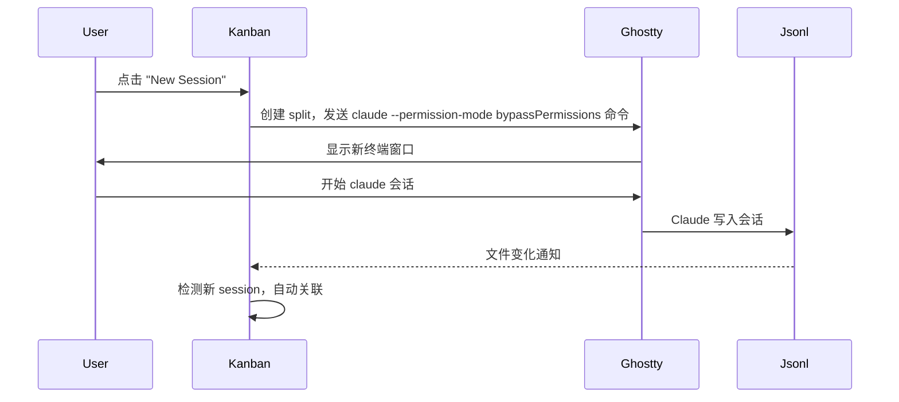
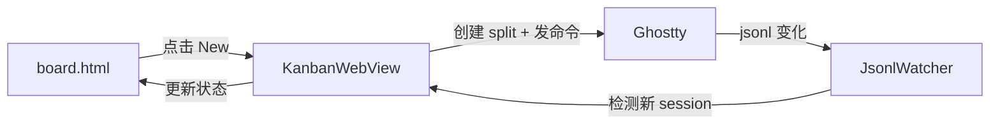
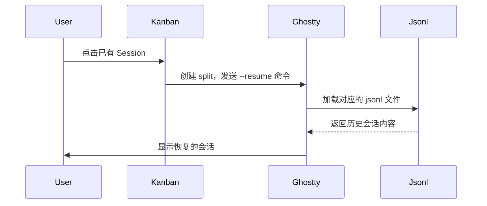

# Ghostty 窗口与 Session 控制架构

## 核心理念

> **Session 由 Claude jsonl 驱动，Kanban 只做展示和关联**

```
用户点击 "New Session"
        │
        ▼
┌─────────────────────────────────────────────────────────────┐
│  Ghostty                                                    │
│  1. 创建新 split (右侧)                                      │
│  2. 发送 "claude --permission-mode bypassPermissions\r"      │
│  3. 用户开始会话 → 写入 jsonl                               │
└─────────────────────────────────────────────────────────────┘
        │
        ▼  jsonl 文件变化监控
┌─────────────────────────────────────────────────────────────┐
│  Ghostty Kanban                                              │
│  检测到新 session → 自动关联到当前 task                    │
└─────────────────────────────────────────────────────────────┘
```

## 用户视角流程



## 新建会话参数

| 参数 | 命令 | 场景 |
|------|------|------|
| **当前分支** | `claude\r` | 在主分支上快速开始会话 |
| **Worktree** | `claude --worktree\r` | 并行任务，隔离环境（name 由 Claude 自动生成） |
| **Bypass Permission** | `claude --permission-mode bypassPermissions\r` | 跳过权限提示 |

### 组合示例

```bash
# 当前分支 + bypassPermissions
claude --permission-mode bypassPermissions\r

# Worktree + bypassPermissions (name 由 Claude 自动生成，如 "bright-running-fox")
claude --permission-mode bypassPermissions --worktree\r
```

## 简化后的架构



## 组件职责

| 组件 | 职责 |
|------|------|
| `board.html` | UI，发送 `createSessionAndLink` 消息 |
| `KanbanWebView` | 桥接 JS ↔ Swift |
| `SidePanelViewModel` | 创建 split，发送 claude 命令 |
| `Ghostty Surface API` | 创建 split，发送文本 |
| `JsonlWatcher` | 监控 jsonl 文件变化，检测新 session |
| `SessionManager` | 管理 session 记录，超时清理 |

## 超时机制（参考 Claudine）

| 常量 | 值 | 说明 |
|------|-----|------|
| `SESSION_LINK_TIMEOUT_MS` | `30_000` | 等待用户创建 session 的超时 |
| `FILE_WATCH_DEBOUNCE_MS` | `500` | jsonl 变化的防抖 |

## Session 显示逻辑

| Session 类型 | Branch 显示 | 指示器颜色 |
|-------------|-------------|-----------|
| Regular (`isWorkTree: false`) | 不显示 branch badge | `idle` / `running` / `need-input` |
| Worktree (`isWorkTree: true`) | 显示 `branch` 字段值，无则为 `main` | `worktree` (紫色) |

```javascript
// board.html renderTaskCard 显示逻辑
<span class="session-branch">
  ${session.isWorkTree ? (session.branch || 'main') : ''}
</span>
```

> 注意：非 worktree session 不应显示 branch badge，只有 worktree session 才显示分支信息。

## Session 名称逻辑（参考 Claudine）

Session 的标题和描述从 Claude Code jsonl 文件中解析得到（参考 `ConversationParser.ts`）：

### 名称提取规则

| 字段 | 来源 | 提取逻辑 |
|------|------|----------|
| **title** | 第一条 user message | 去除 XML tags 后取第一行，最大 60 字符 |
| **description** | 第一条 assistant message | 去除 XML tags 后取第一段，最大 120 字符 |
| **session.id** | jsonl 文件名 | `path.basename(filePath, '.jsonl')` |
| **worktreeName** | `worktree-state` JSONL entry | `entry.worktreeSession?.worktreeName` |
| **gitBranch** | JSONL `gitBranch` 字段 | 直接取值，非 HEAD 则保留 |
| **status** | 从 message 内容检测 | `running` / `idle` / `need-input` |

### 标题提取伪代码（Claudine 实现）

```typescript
function extractTitle(messages: ParsedMessage[]): string {
  const firstUser = messages.find(m => m.role === 'user' && m.textContent.trim());
  if (!firstUser) return 'Untitled Conversation';

  // 去除 <system-reminder>, <ide_opened_file> 等 XML tags
  const content = stripMarkupTags(firstUser.textContent.trim());
  if (!content) return 'Untitled Conversation';

  const firstLine = content.split('\n')[0];
  return firstLine.length > MAX_TITLE_LENGTH
    ? firstLine.slice(0, MAX_TITLE_LENGTH - 3) + '...'
    : firstLine;
}

function stripMarkupTags(text: string): string {
  return text.replace(/<([a-zA-Z][\w-]*)[\s>][^]*?<\/\1>/g, '').trim();
}
```

### Status 检测逻辑

| 条件 | Status |
|------|--------|
| 有 tool_use 且刚执行完 | `running` |
| 用户刚回复 | `running` |
| 有 pending tool_use | `running` |
| 需要用户输入（AskUserQuestion） | `need-input` |
| 会话空闲无活动 | `idle` |

## 恢复 Session 命令

> **关键区别**：`--session-id` 用于创建新 session，`--resume` 用于恢复已有 session

| 场景 | 命令 | 说明 |
|------|------|------|
| **恢复普通 Session** | `claude --resume <sessionId> --permission-mode bypassPermissions\r` | 恢复已存在的 session |
| **恢复 Worktree Session** | `claude --resume <sessionId> --worktree <name> --permission-mode bypassPermissions\r` | 需要指定 worktree 名称 |

### `--session-id` vs `--resume` 区别

# --session-id: 创建/关联新 session（如果 ID 已存在则报错 "already in use"）
claude --session-id=<uuid> --permission-mode bypassPermissions\r

# --resume: 恢复已存在的 session
claude --resume <sessionId> --permission-mode bypassPermissions\r

### 恢复 Session 流程



## 待实现

1. `JsonlWatcher` - 监控 `~/.claude/projects/*/data.jsonl`
2. 自动关联 - 临时 Session ID → 真实 Session ID
3. 超时清理 - 30秒无 session 则清理
