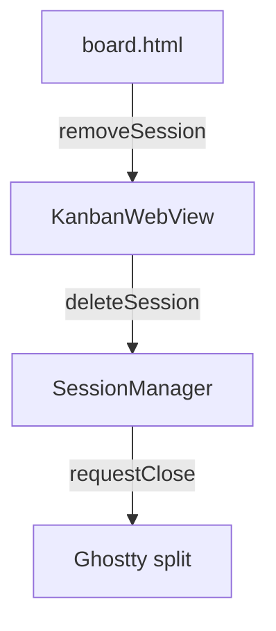
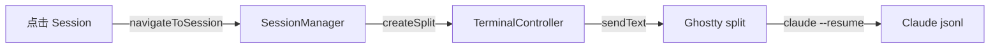

# Session 生命周期管理

## 核心理念

> **Session 关联 Ghostty split，删除时关闭 split，恢复时重建 split**

```
Session ──关联──> Ghostty Surface (split)
     │
     └── sessionId: Claude jsonl 的 UUID，用于 resume
```

## 删除 Session

### 用户流程

1. 用户在 board.html 点击 Session 的删除按钮
2. 关闭对应的 Ghostty split
3. 从 sessions.json 移除记录

### 数据流



### 实现

```swift
// SessionManager
func deleteSession(sessionId: UUID) {
    // 1. 查找 session
    guard let session = sessions.first(where: { $0.id == sessionId }) else { return }

    // 2. 关闭 surface（如果存在）
    if let surfaceId = session.surfaceId {
        NotificationCenter.default.post(
            name: .kanbanCloseSurface,
            object: nil,
            userInfo: ["surfaceId": surfaceId]
        )
    }

    // 3. 移除
    sessions.removeAll { $0.id == sessionId }
    saveSessions()
}
```

```swift
// TerminalController
@objc private func onKanbanCloseSurface(_ notification: Notification) {
    guard let surfaceId = notification.userInfo?["surfaceId"] as? UInt64 else { return }

    // 找到对应的 surface 并关闭
    if let surfaceView = findSurfaceView(by: surfaceId) {
        ghostty.requestClose(surface: surfaceView.surface)
    }

    // 同步解除关联
    SessionManager.shared.unlinkSurface(surfaceId: surfaceId)
}
```

---

## 恢复 Session（Resume）

### 用户流程

1. 用户点击 board.html 中的一个 Session
2. 系统创建新的 Ghostty split
3. 发送 `claude --session-id=<sessionId> --worktree <branch>` 命令
4. Claude 自动加载对应的 jsonl 文件

### 数据流



### 命令格式

```bash
# 普通 session（使用 --resume，不是 --session-id）
claude --resume <sessionId> --permission-mode bypassPermissions\r

# worktree session
claude --resume <sessionId> --worktree <name> --permission-mode bypassPermissions\r
```

其中 `sessionId` 是 Claude jsonl 文件的 UUID（即 Session.sessionId）。

> **注意**：恢复已存在的 session 必须用 `--resume`，不能用 `--session-id`（后者用于创建新 session）

### 实现

```swift
// SessionManager
func navigateToSession(id: UUID) {
    guard let session = sessions.first(where: { $0.id == id }) else { return }

    NotificationCenter.default.post(
        name: .kanbanResumeSession,
        object: nil,
        userInfo: ["sessionId": id]
    )
}
```

```swift
// TerminalController
@objc private func onKanbanResumeSession(_ notification: Notification) {
    guard let sessionId = notification.userInfo?["sessionId"] as? UUID,
          let session = SessionManager.shared.session(for: sessionId) else { return }

    guard let sourceSurface = self.focusedSurface?.surface else { return }

    // 1. 创建 split
    ghostty.split(surface: sourceSurface, direction: GHOSTTY_SPLIT_DIRECTION_RIGHT)

    // 2. 等待 split 创建
    DispatchQueue.main.asyncAfter(deadline: .now() + 0.1) { [weak self] in
        guard let newSurface = self?.focusedSurface?.surface else { return }

        // 3. 构建 resume 命令（使用 --resume，不是 --session-id）
        var command = "claude --resume \(session.sessionId ?? sessionId.uuidString)"
        if session.isWorkTree {
            command += " --worktree \(session.branch)"
        }
        command += " --permission-mode bypassPermissions\r"

        // 4. 发送命令
        Ghostty.Surface(cSurface: newSurface).sendText(command)

        // 5. 更新 surfaceId 关联
        SessionManager.shared.linkSessionToSurface(
            sessionId: sessionId,
            surfaceId: UInt64(newSurface)
        )
    }
}
```

---

## Session 状态（关联 surface 时）

| 场景 | 操作 |
|------|------|
| Session 有 surfaceId | 关联到某个 split |
| surface 被用户关闭 | 自动 unlink（清除 surfaceId） |
| 删除 Session | 关闭 surface 并移除记录 |
| 恢复 Session | 创建新 surface 并关联 |

## 待实现

1. `kanbanCloseSurface` notification 定义和监听
2. `findSurfaceView(by surfaceId:)` 方法
3. TerminalController 监听 surface 关闭事件，自动 unlink
