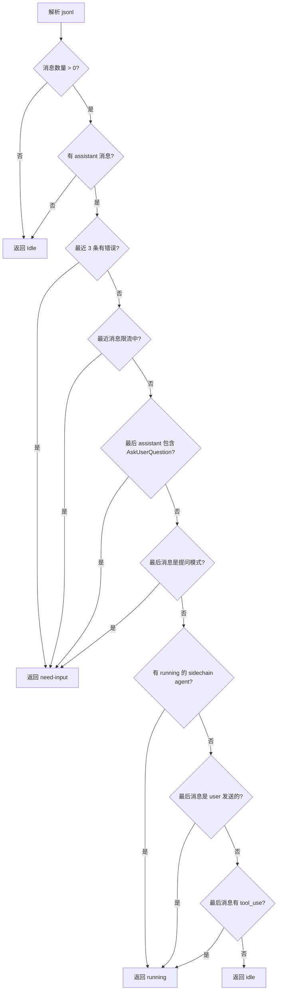
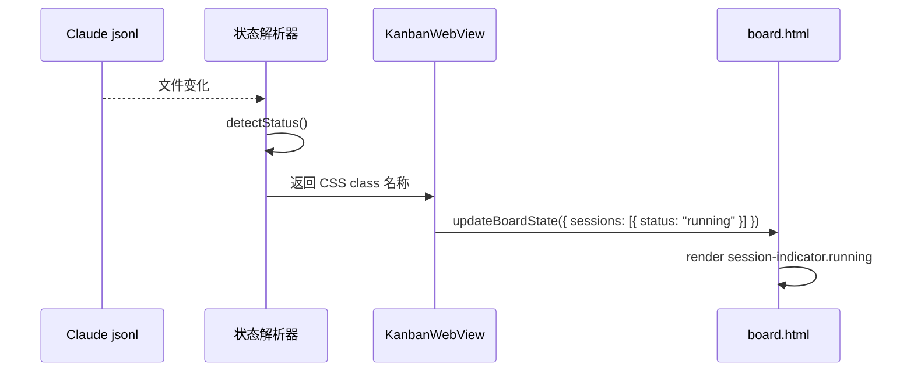

# Session 状态更新逻辑

## 状态定义

| 状态 | CSS Class | 颜色 | 含义 |
|------|-----------|------|------|
| **Idle** | `idle` | 灰色 | 会话空闲/已完成 |
| **Need Input** | `need-input` | 橙色 | 等待用户输入 |
| **In Progress** | `running` | 绿色 | 正在工作 |

> **注意**: CSS class 使用 `need-input`（无 s）和 `running`，与 Claudine 的 `needs-input` 和 `in-progress` 不同。

## 状态映射

```
Claudine 状态值          CSS Class (board.html)
─────────────────────────────────────────────
idle                    → idle
needs-input             → need-input
in-progress             → running
in-review               → (不使用)
todo                    → idle
```

## 三种状态检测条件

### Need Input (need-input)

| 条件 | 说明 |
|------|------|
| `hasError` | 最近消息包含错误 |
| `isRateLimited` | 会话被限流（且未过期） |
| `AskUserQuestion` | Claude 调用了提问工具 |
| 提问模式 | 包含 `should I`, `would you like`, `do you want`, `shall I`, `please confirm` 等 |

### In Progress (running)

| 条件 | 说明 |
|------|------|
| `hasRunningAgents` | 有 sidechain agent 正在运行 |
| `lastMessage.role === 'user'` | 最后一条消息是用户发送的 |
| `toolUses.length > 0` | 最后一条 assistant 消息有待执行的 tool |

### Idle (idle)

其他所有情况。

## 状态检测流程



## 完整数据流



## 实现要点

### 1. 状态解析返回值

```swift
enum SessionStatus {
    case idle
    case needInput
    case inProgress
}

// 转为 CSS class 名称
func toCSSClass(_ status: SessionStatus) -> String {
    switch status {
    case .idle: return "idle"
    case .needInput: return "need-input"
    case .inProgress: return "running"
    }
}
```

### 2. 发送到前端

```swift
// KanbanWebView.swift sendBoardState()
let script = """
updateBoardState({ tasks: \(encodeToJSON(tasks)) });
"""

// tasks 中的 session 包含 status 字段，已经是 CSS class 名称
```

### 3. 前端接收

```javascript
// board.html renderTaskCard()
<div class="session-indicator ${session.status}">
// session.status 已经是 "idle", "need-input", 或 "running"
```

## Rate Limit 时间验证

Claudine 实现会检查 rate limit 是否真正生效：

```swift
if isRateLimited {
    // 检查是否真正在限流中
    if rateLimitResetTime > now {
        return .needInput  // 仍在限流中
    }
    // 或消息在 6 小时内
    if messageTimestamp > now - 6.hours {
        return .needInput
    }
}
```

## 提问模式正则

```swift
let questionPatterns = [
    "\\b(should I|would you like|do you want|shall i)\\b",
    "\\bplease (confirm|approve|review)\\b",
    "\\bwhich (option|approach) (would|do|should)\\b",
    // AskUserQuestion 工具调用
]
```

## 待实现

1. `SessionStatus` 枚举定义
2. `detectStatus()` 解析函数
3. `toCSSClass()` 映射函数
4. JsonlWatcher 集成
