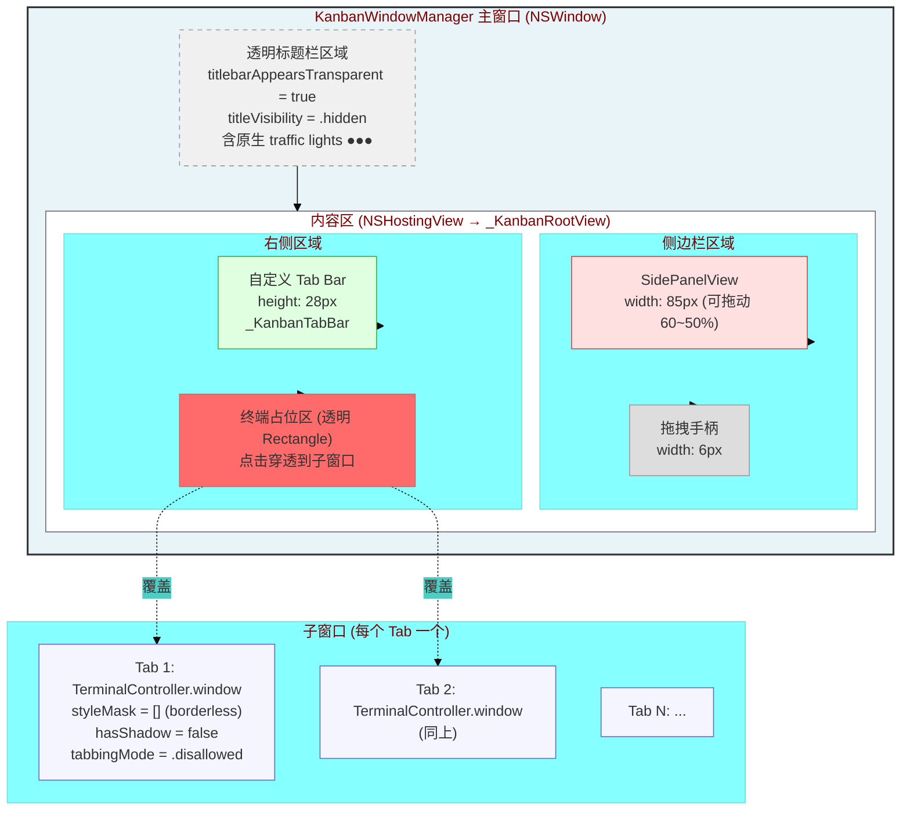
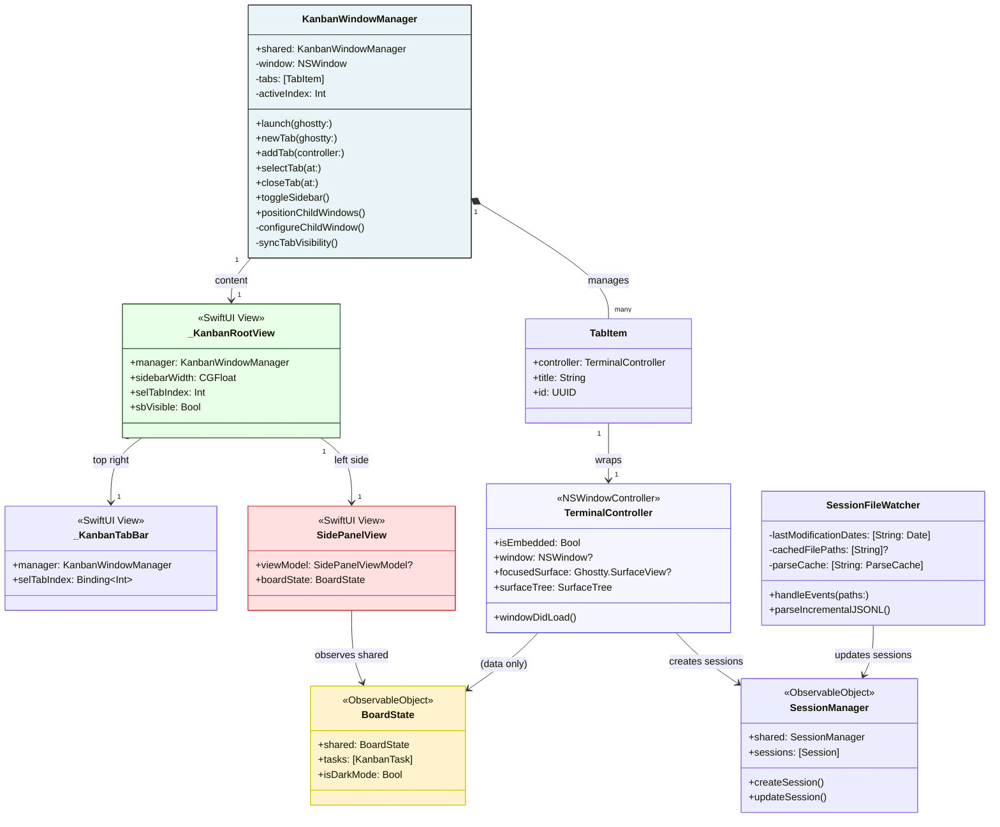
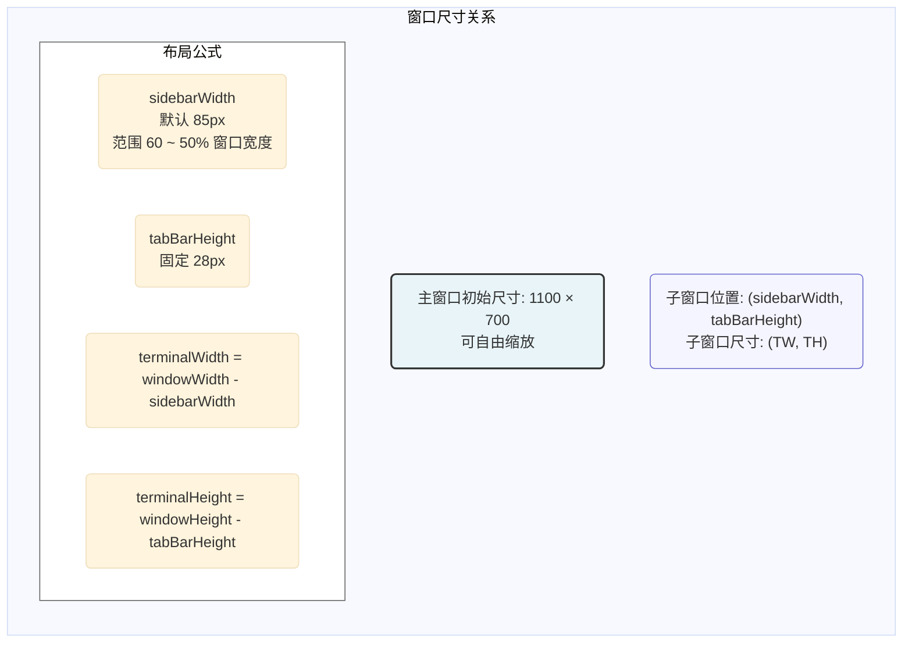
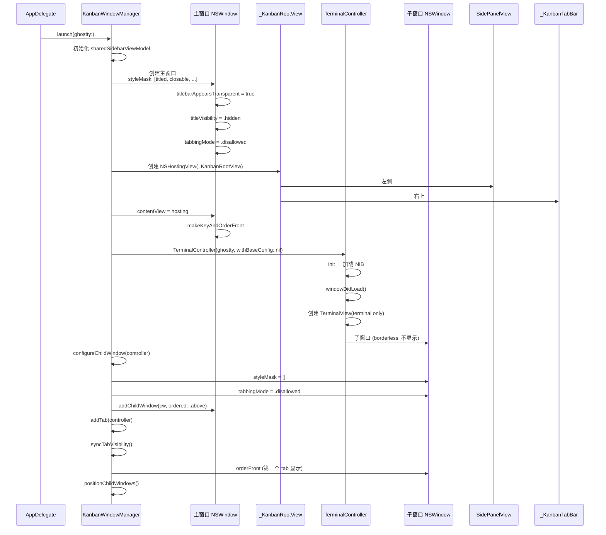
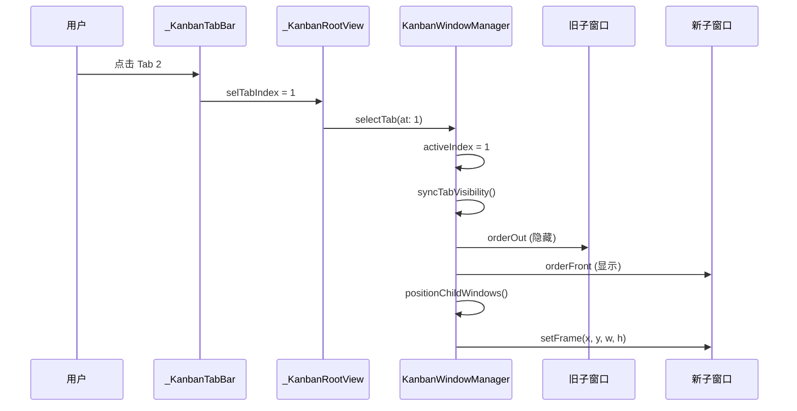
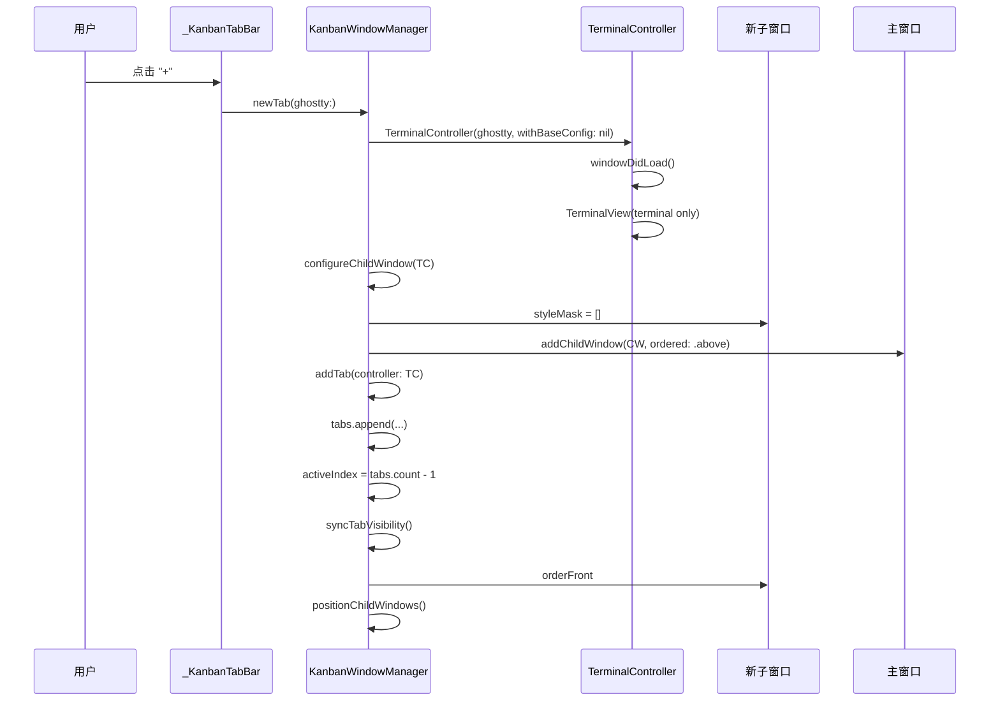
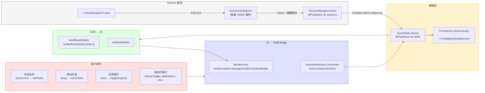
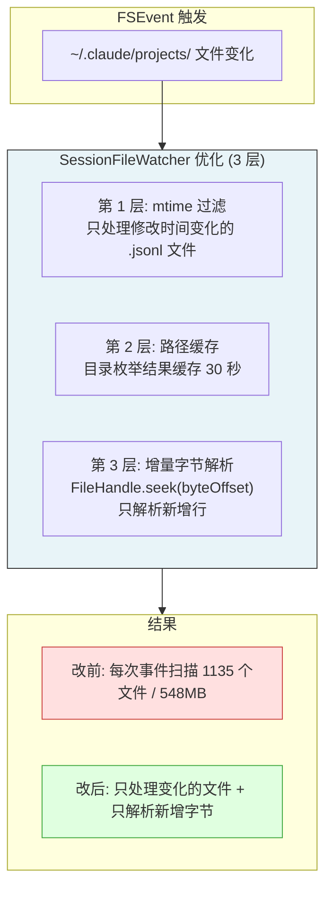
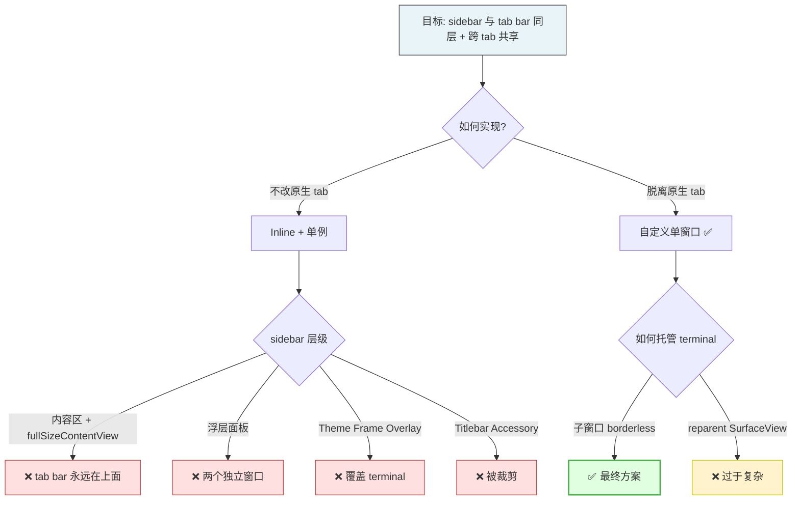

# Ghostty Kanban 最终架构文档

> 基于自定义单窗口 + borderless 子窗口方案，
> sidebar 与 tab bar 位于同一层级。

---

## 1. 总体布局

---

## 2. 窗口层级关系

---

## 3. 详细尺寸与约束

**关键约束：**

- `terminalWidth = windowWidth - sidebarWidth`
- `terminalHeight = windowHeight - tabBarHeight`
- 子窗口最小尺寸：`40 × 40`（小于时不更新布局）
- sidebarWidth 持久化到 `UserDefaults.standard(forKey: "kanban_sidebar_width")`
- 拖拽时实时更新子窗口位置（`positionChildWindows()`）

---

## 4. 启动流程

---

## 5. Tab 切换流程

---

## 6. 新建 Tab 流程

---

## 7. 数据流

---

## 8. 性能优化策略

---

## 9. 架构演进决策树

---

## 10. 文件清单

| 文件 | 作用 | 关键类/结构 |
|------|------|-------------|
| `SidePanel/KanbanWindowManager.swift` | 主窗口 + tab 管理器 | `KanbanWindowManager`, `_KanbanRootView`, `_KanbanTabBar` |
| `SidePanel/SidePanelView.swift` | Sidebar SwiftUI 视图 | `SidePanelView` |
| `SidePanel/KanbanWebView.swift` | JS ↔ Swift 桥接 | `KanbanWebView.Coordinator` |
| `SidePanel/KanbanBoardState.swift` | 任务数据单例 | `BoardState.shared` |
| `SidePanel/KanbanModels.swift` | 数据模型 | `KanbanTask`, `Session` |
| `SidePanel/SessionManager.swift` | Session 管理单例 | `SessionManager.shared` |
| `SidePanel/SessionFileWatcher.swift` | JSONL 文件监听 + 增量解析 | `SessionFileWatcher` |
| `SidePanel/SidePanelViewModel.swift` | Terminal 桥接 | `SidePanelViewModel` |
| `SidePanel/Persistence.swift` | JSON 持久化 | `Persistence.shared` |
| `Features/Terminal/TerminalController.swift` | Terminal 控制器 | `TerminalController`, `KanbanSidebarContainer` |
| `Features/Terminal/TerminalView.swift` | Terminal SwiftUI 视图 | `TerminalView` |
| `Features/Terminal/TerminalViewContainer.swift` | Terminal NSView 容器 | `TerminalViewContainer` |
| `App/macOS/AppDelegate.swift` | App 入口 | `AppDelegate` |

---

> 最后更新: 2026-04-29
> 对应 commit: `0b0b53486`
